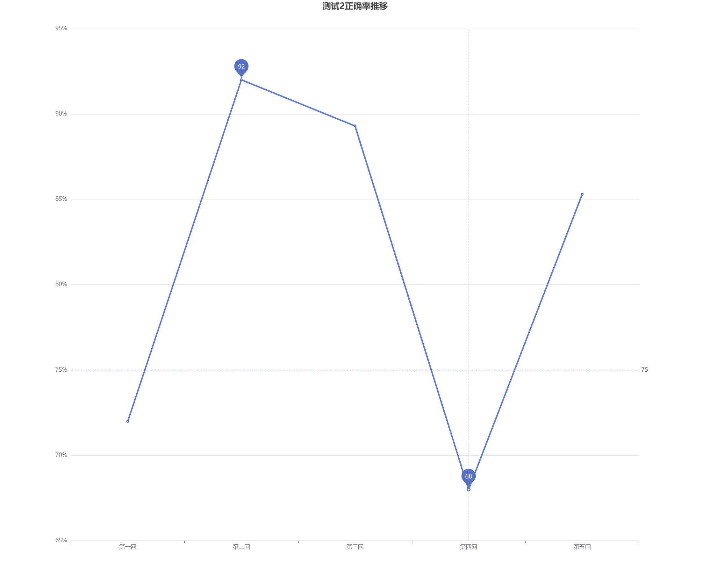
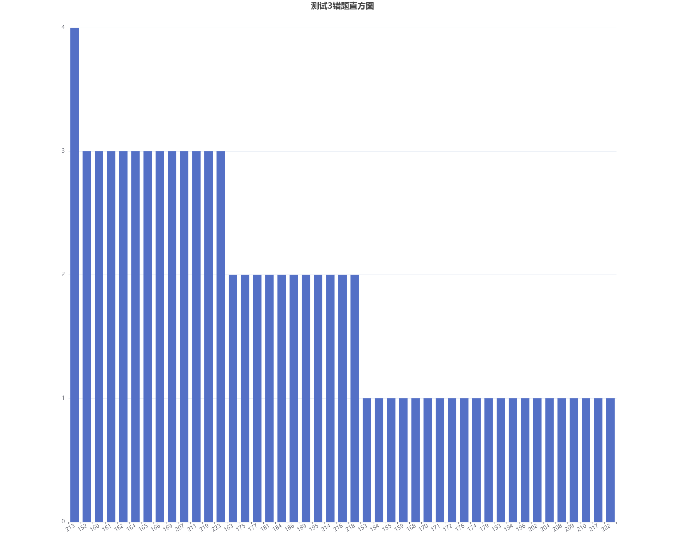
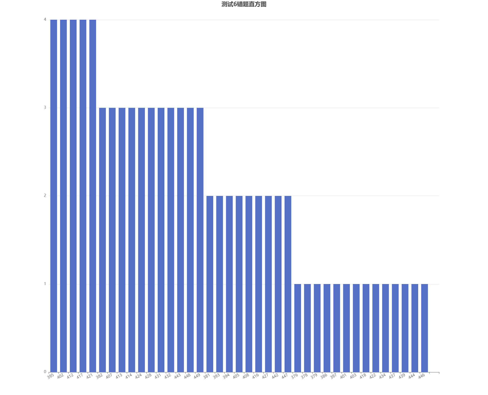

# 统计

## 2021年8月24日测试错题（一）

- 451, 454, 455, 459, 460, 407, 468, 470, 472, 473, 476, 477, 482, 483, 484, 486, 489, 490, 492, 494, 495, 496, 499, 500, 501, 503, 505, 506, 507, 508, 511, 512, 516, 518
- 正确率51.47%

## 2021年8月24日测试错题（二）

- 468, 472, 477, 488, 489, 492, 499, 501, 503, 504, 508, 511
- 正确率82.35%

## 测试1（第1套Q1~第1套Q75）

## 测试2（第1套Q76~第2套Q50）

## 测试3（第2套Q51~第3套Q25）

## 测试4（第3套Q26~第3套Q100）

## 测试5（第4套Q300~第4套Q375）

## 测试6（第4套Q376~第5套Q450）

