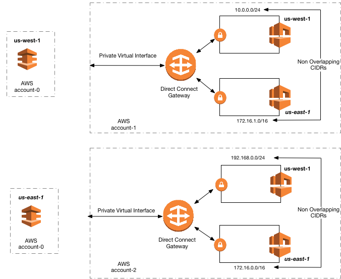

# AWS SAP 101-200

1. A company is moving a business-critical application onto AWS. It is a traditional three-tier web application using an Oracle database. Data must be encrypted in transit and at rest. The database hosts 12 TB of data. Network connectivity to the source Oracle database over the internal is allowed, and the company wants to reduce the operational costs by using AWS Managed Services where possible. All primary keys only; however, it contains many Binary Large Object (BLOB) fields. It was not possible to use the database's native replication tools because of licensing restrictions. Which database migration solution will result in the LEAST amount of impact to the application's availability?
   - [ ] A. Provision an Amazon RDS for Oracle instance. Host the RDS database within a virtual private cloud (VPC) subnet with internet access and set up the RDS database as an encrypted Read Replica of the source database. Use SSL to encrypt the connection between the two databases. Monitor the replication performance by watching the RDS Replica Lag metric. During the application maintenance window, shut down the on-premises database and switch over the application connection to the RDS instance when there is no more replication lag. Promote the Read Replica into a standalone database instance.
   - [ ] B. Provision an Amazon EC2 instance and install the same Oracle database software. Create a backup of the source database using the supported tools. During the application maintenance window, restore the backup into the Oracle database running in the EC2 instance. Set up an Amazon RDS for Oracle instance and create an import job between the database hosted in AWS. Shut down the source database and switch over the database connections to the RDS instance when the job is complete.
   - [ ] C. Use AWS DMS to load and replicate the dataset between the on-premises Oracle database and the replication instance hosted on AWS. Provision an Amazon RDS for Oracle instance with Transparent Data Encryption (TDE) enabled and configure it as target for the replication instance. Create a customer-managed AWS KMS master key to set it as the encryption key for the replication instance. Use AWS DMS tasks to load the data into the target RDS instance. During the application maintenance window and after the load tasks reach the ongoing replication phase, switch the database connections to the new database.
   - [ ] D. Create a compressed full database backup on the on-premises Oracle database during an application maintenance window. While the backup is being performed, provision a 10 Gbps AWS Direct Connect connection to increase the transfer speed of the database backup files to Amazon S3 and shorten the maintenance window period. Use SSL/TLS to copy the files over the Direct Connect connection. When the backup files are successfully copied, start the maintenance window, and rise any of the Amazon RDS supported tools to import the data into a newly provisioned Amazon RDS for Oracle instance with encryption enabled. Wait until the data is fully loaded and switch over the database connections to the new database. Delete the Direct Connect connection to cut unnecessary charges.

   

      
Answer

      - [ ] A. 如果不限制本地复制的话此乃最佳体验
      - [ ] B. 备份不能保证数据的完整性
      - [x] C. 正确
      - [ ] D. 要做很多额外的事儿不满足需求

   

2. A company has detected to move some workloads onto AWS to create a grid environment to run market analytics. The grid will consist of many similar instances, spun-up by a job-scheduling function. Each time a large analytics workload is completed, a new VPC is deployed along with job scheduler and grid nodes. Multiple grids could be running in parallel. Key requirements are grid instances must communicate with Amazon S3 retrieve data to be processed. Grid instances must communicate with Amazon DynamoDB to track intermediate data, The job scheduler need only to communicate with the Amazon EC2 API to start new grid nodes. A key requirement is that the environment has no access to the internet, either directly or via the on-premises proxy. However, the application needs to be able to seamlessly communicate to Amazon S3, Amazon DynamoDB, and Amazon EC2 API, without the need for reconfiguration for each new deployment. Which of the following should the Solutions Architect do to achieve this target architecture? (Choose three.)
   - [ ] A. Enable VPC endpoints for Amazon S3 and DynamoDB.
   - [ ] B. Disable Private DNS Name Support.
   - [ ] C. Configure the application on the grid instances to use the private DNS name of the Amazon S3 endpoint.
   - [ ] D. Populate the on-premises DNS server with the private IP addresses of the EC2 endpoint.
   - [ ] E. Enable an interface VPC endpoint for EC2.
   - [ ] F. Configure Amazon S3 endpoint policy to permit access only from the grid nodes.

   

      
Answer

      标准操作，答案AEF

   

3. An internal security audit of AWS resources within a company found that several Amazon EC2 instances running Microsoft Windows workloads were missing several important operating system-level patches. A Solutions Architect has been asked to fix existing patch deficiencies, and to develop a workflow to ensure that future patching requirements are identified and taken care of quickly. The Solutions Architect has decided to use AWS Systems Manager. It is important that EC2 instance reboots do not occur at the same time on all Windows workloads to meet organizational uptime requirements. Which workflow will meet these requirements in an automated manner?
   - [ ] A. Add a Patch Group tag with a value of Windows Servers to all existing EC2 instances. Ensure that all Windows EC2 instances are assigned this tag. Associate the AWS-DefaultPatchBaseline to the Windows servers patch group. Define an AWS Systems Manager maintenance window, conduct patching within it, and associate it with the Windows Servers patch group. Register instances with the maintenance window using associated subnet IDs. Assign the AWS-RunPatchBaseline document as a task within each maintenance window.
   - [ ] B. Add a Patch Group tag a value of Windows Servers to all existing EC2 instances. Ensure that all Windows EC2 instances are assigned this tag. Associate the AWS-WindowsPatchBaseline document as a task associated with the Windows Servers patch group. Create an Amazon CloudWatch Events rule configured to use a cron expression to schedule the execution of patching using the AWS Systems Manager run command. Create an AWS Systems Manager State Manager document to define commands to be executed during patch execution.
   - [ ] C. Add a Patch Group tag with a value of either Windows Server1 or Windows Server2 to all existing EC2 instances. Ensure that all Windows EC2 instances are assigned this tag. Associate the AWS- DefaultPatchBaseline with both Windows Servers patch groups. Define two non-overlapping AWS Systems Manager maintenance windows, conduct patching within them, and associate each with a different patch group. Register targets with specific maintenance windows using the Patch Group tags. Assign the AWS-RunPatchBaseline document as a task within each maintenance window.
   - [ ] D. Add a Patch Group tag with a value of either Windows server1 or Windows Server2 to all existing EC2 instances. Ensure that all Windows EC2 instances are assigned this tag. Associate the AWS- WindowsPatchBaseline with both Windows Servers patch groups. Define two non-overlapping AWS Systems Manager maintenance windows, conduct patching within them, and associate each with a different patch group. Assign the AWS-RunWindowsPatchBaseline document as a task within each maintenance window. Create an AWS Systems Manager State Manager document to define commands to be executed during patch execution.

   

      
Answer

      - [ ] A. 打补丁将会同时发生，不满足需求
      - [ ] B. 不存在AWS-WindowsPatchBaseline
      - [x] C. 正确
      - [ ] D. 同B

   

4. A company must deploy multiple independent instances of an application. The front-end application is internet accessible. However, corporate policy stipulates that the backends are to be isolated from each other and the internet, yet accessible from a centralized administration server. The application setup should be automated to minimize the opportunity for mistakes as new instances are deployed. Which option meets the requirements and MINIMIZES costs?
   - [ ] A. Use an AWS CloudFormation template to create identical IAM roles for each region. Use AWS CloudFormation StackSets to deploy each application instance by using parameters to customize for each instance and use security groups to isolate each instance while permitting access to the central server.
   - [ ] B. Create each instance of the application IAM roles and resources in separate accounts by using AWS CloudFormation StackSets. Include a VPN connection to the VPN gateway of the central administration server.
   - [ ] C. Duplicate the application IAM roles and resources in separate accounts by using a single CloudFormation template. Include VPC peering to connect the VPC of each application instance to a central VPC.
   - [ ] D. Use the parameters of the AWS CloudFormation template to customize the deployment into separate accounts. Include a NAT gateway to allow communication back to the central administration server.

   

      
Answer

      - [ ] A. 安全组不能跨区域
      - [ ] B. 没必要使用VPN
      - [x] C. 正确
      - [ ] D. 不走公网，没必要使用NAT

   

5. A group of Amazon EC2 instances have been configured as high-performance computing (HPC) cluster. The instances are running in a placement group and can communicate with each other at network of up to 20 Gbps. The cluster needs to communicate with a control EC2 instance outside of the placement group. The control instance has the same instance type and AMI as the other instances and is configured with a public IP address. How can the Solutions Architect improve the network speeds between the control instance and the instances in the placement group?
   - [ ] A. Terminate the control instance and relaunch in the placement group.
   - [ ] B. Ensure that the instances are communicating using the private IP addresses.
   - [ ] C. Ensure that the control instance is using an Elastic Network Adapter.
   - [ ] D. Move the control instance inside the placement group.

   

      
Answer

      把控制实例移动到放置组里就行，ENA是默认启动的，答案D

   

6. A Solutions Architect has created an AWS CloudFormation template for a three-tier application that contains an Auto Scaling group of Amazon EC2 instances running a custom AMI. The Solutions Architect wants to ensure that future updates to the custom AMI can be deployed to a running stack by first updating the template to refer to the new AMI, and then invoking UpdateStack to replace the EC2 instances with instances launched from the new AMI. How can updates to the AMI be deployed to meet these requirements?
   - [ ] A. Create a change set for a new version of the template, view the changes to the running EC2 instances to ensure that the AMI is correctly updated, and then execute the change set.
   - [ ] B. Edit the AWS::AutoScaling::LaunchConfiguration resource in the template, changing its to Replace. DeletionPolicy
   - [ ] C. Edit the AWS::AutoScaling::LaunchConfiguration resource in the template, inserting an attribute. UpdatePolicy
   - [ ] D. Create a new stack from the updated template. Once it is successfully deployed, modify the DNS records to point to the new stack and delete the old stack.

   

      
Answer

      概念题，答案C

   

7. A Solutions Architect is designing a multi-account structure that has 10 existing accounts. The design must meet the following requirements:Consolidate all accounts into one organization. Allow full access to the Amazon EC2 service from the master account and the secondary accounts. Minimize the effort required to add additional secondary accounts. Which combination of steps should be included in the solution? (Choose two.)
   - [ ] A. Create an organization from the master account. Send invitations to the secondary accounts from the master account. Accept the invitations and create an OU.
   - [ ] B. Create an organization from the master account. Send a join request to the master account from each secondary account. Accept the requests and create an OU.
   - [ ] C. Create a VPC peering connection between the master account and the secondary accounts. Accept the request for the VPC peering connection.
   - [ ] D. Create a service control policy (SCP) that enables full EC2 access, and attach the policy to the OUT
   - [ ] E. Create a full EC2 access policy and map the policy to a role in each account. Trust every other account to assume the role.

   

      
Answer

      概念题，答案AD

   

8. AnyCompany has acquired numerous companies over the past few years. The CIO for AnyCompany would like to keep the resources for each acquired company separate. The CIO also would like to enforce a chargeback model where each company pays for the AWS services it uses. The Solutions Architect is tasked with designing an AWS architecture that allows AnyCompany to achieve the following:lmplementing a detailed charge back mechanism to ensure that each company pays for the resources it uses. AnyCompany can pay for AWS services for all its companies through a single invoice. Developers in each acquired company have access to resources in their company only. Developers in an acquired company should not be able to affect resources in their company only. A single identity store is used to authenticate Developers across all companies. Which of the following approaches would meet these requirements? (Choose two.)
   - [ ] A. Create a multi-account strategy with an account per company. Use consolidated billing to ensure that AnyCompany needs to pay a single bill only.
   - [ ] B. Create a multi-account strategy with a virtual private cloud (VPC) for each company. Reduce impact across companies by not creating any VPC peering links. As everything is in a single account, there will be a single invoice. use tagging to create a detailed bill for each company.
   - [ ] C. Create IAM users for each Developer in the account to which they require access. Create policies that allow the users access to all resources in that account. Attach the policies to the IAM user.
   - [ ] D. Create a federated identity store against the company's Active Directory. Create IAM roles with appropriate permissions and set the trust relationships with AWS and the identity store. Use AWS STS to grant users access based on the groups they belong to in the identity store.
   - [ ] E. Create a multi-account strategy with an account per company. For billing purposes, use a tagging solution that uses a tag to identify the company that creates each resource.

   

      
Answer

      简单题，答案AD

   

9. A company deployed a three-tier web application in two regions:us-east-1 and eu-west-1. The application must be active in both regions at the same time. The database tier of the application uses a single Amazon RDS Aurora database globally, with a master in us-east-1 and a read replica in eu-west-1. Both regions are connected by a VPN The company wants to ensure that the application remains available even in the event of a region-level failure of all the application's components. It is acceptable for the application to be in read-only mode for up to 1 hour. The company plans to configure two Amazon Route 53 record sets, one for each of the regions. How should the company complete the configuration to meet its requirements while providing the lowest latency for the application end-users? (Choose two.)
   - [ ] A. Use failover routing and configure the us-east-1 record set as primary and the eu-west-1 record set as secondary. Configure an HTTP health check for the web application in us-east-1, and associate it to the us-east-1 record set.
   - [ ] B. Use weighted routing and configure each record set with a weight of 50. Configure an HTTP health check for each region and attach it to the record set for that region.
   - [ ] C. Use latency-based routing for both record sets. Configure a health check for each region and attach it to the record set for that region.
   - [ ] D. Configure an Amazon CloudWatch alarm for the health checks in us-east-1, and have it invoke an AWS Lambda function that promotes the read replica in eu-west-1.
   - [ ] E. Configure an Amazon RDS event notifications to react to the failure of the database in us-east-1 by invoking an AWS Lambda function that promotes the read replica in eu-west-1.

   

      
Answer

      - [ ] A. 无法保证低延迟
      - [ ] B. 无法保证低延迟
      - [x] C. 正确
      - [ ] D. 健康检查不代表数据库错误
      - [x] E. 正确

   

10. A company runs a Windows Server host in a public subnet that is configured to allow a team of administrators to connect over RDP to troubleshoot issues with hosts in a private subnet. The host must be always available outside of a scheduled maintenance window and needs to receive the latest operating system updates within 3 days of release. What should be done to manage the host with the LEAST amount of administrative effort?
    - [ ] A. Run the host in a single-instance AWS Elastic Beanstalk environment. Configure the environment with a custom AMI to use a hardened machine image from AWS Marketplace. Apply system updates with AWS Systems Manager Patch Manager.
    - [ ] B. Run the host on AWS WorkSpaces. Use Amazon WorkSpaces Application Manager (WAM) to harden the host. Configure Windows automatic updates to occur every 3 days.
    - [ ] C. Run the host in an Auto Scaling group with a minimum and maximum instance count of 1. Use a hardened machine image from AWS Marketplace. Apply system updates with AWS Systems Manager Patch Manager.
    - [ ] D. Run the host in AWS OpsWorks Stacks. Use a Chief recipe to harden the AMI during instance launch. Use an AWS Lambda scheduled event to run the Upgrade Operating System stack command to apply system updates.

    

       
Answer

       - [ ] A. 无法保证你的应用可以跟Elastic Beanstalk兼容
       - [ ] B. 没WorkSpaces什么事儿
       - [x] C. 正确
       - [ ] D. 没有Scheduled Lambda

    

11. A company has a large on-premises Apache Hadoop cluster with a 20 PB HDFS database. The cluster is growing every quarter by roughly 200 instances and 1 PB The company's goals are to enable resiliency for its Hadoop data, limit the impact of losing cluster nodes, and significantly reduce costs. The current cluster runs 24/7 and supports a variety of analysis workloads, including interactive queries and batch processing. Which solution would meet these requirements with the LEAST expense and down time?
    - [ ] A. Use AWS Snowmobile to migrate the existing cluster data to Amazon S3. Create a persistent Amazon EMR cluster initially sized to handle the interactive workload based on historical data from the on-premises cluster. Store the data on EMRFS. Minimize costs using Reserved Instances for master and core nodes and Spot Instances for task nodes, and auto scale task nodes based on Amazon CloudWatch metrics. Create job-specific, optimized clusters for batch workloads that are similarly optimized.
    - [ ] B. Use AWS Snowmobile to migrate the existing cluster data to Amazon S3. Create a persistent Amazon EMR cluster of similar size and configuration to the current cluster. Store the data on EMRFS. Minimize costs by using Reserved Instances. As the workload grows each quarter, purchase additional Reserved Instances, and add to the cluster.
    - [ ] C. Use AWS Snowball to migrate the existing cluster data to Amazon S3. Create a persistent Amazon EMR cluster initially sized to handle the interactive workloads based on historical data from the on-premises cluster. Store the on ENIRFS. Minimize costs using Reserved Instances for master and core nodes and Spot Instances for task nodes, and auto scale task nodes based on Amazon CloudWatch metrics. Create job-specific, optimized clusters for batch workloads that are similarly optimized.
    - [ ] D. Use AWS Direct Connect to migrate the existing cluster data to Amazon S3. Create a persistent Amazon EMR cluster initially sized to handle the interactive workload based on historical data from the on-premises cluster. Store the data on EMRFS. Minimize costs using Reserved Instances for master and core nodes and Spot Instances for task nodes, and auto scale task nodes based on Amazon CloudWatch metrics. Create job-specific, optimized clusters for batch workloads that are similarly optimized.

    

       
Answer

       - [x] A. 正确
       - [ ] B. 工作节点使用预留实例是一种浪费
       - [ ] C. 10PB以上使用Snowmobile
       - [ ] D. AWS Direct Connect跟Snowmobile比慢得一批

    

12. A company is running a large application on-premises. Its technology stack consists of Microsoft .NET for the web server platform and Apache Cassandra for the database. The company wants to migrate the application to AWS to improve service reliability. The IT team also wants to reduce the time it spends on capacity management and maintenance of this infrastructure. The Development team is willing and available to make changes to support the migration. Which design is the LEAST complex to manage after the migration?
    - [ ] A. Migrate the web servers to Amazon EC2 instances in an Auto Scaling group that is running .NET. Migrate the existing Cassandra database to Amazon Aurora with multiple read replicas and run both in a Multi-AZ mode.
    - [ ] B. Migrate the web servers to an AWS Elastic Beanstalk environment that is running the .NET platform in a Multi-AZ Auto Scaling configuration. Migrate the Cassandra database to Amazon EC2 instances that are running in a MuIti-AZ configuration.
    - [ ] C. Migrate the web servers to an AWS Elastic Beanstalk environment that is running the .NET platform in a Multi-AZ Auto Scaling configuration. Migrate the existing Cassandra database to Amazon DynamoDB.
    - [ ] D. Migrate the web servers to Amazon EC2 instances in an Auto Scaling group that is running .NET. Migrate the existing Cassandra database to Amazon DynamoDB.

    

       
Answer

       简单题，卡珊德拉可以用DynamoDB进行替代，答案C

    

13. A company has a requirement that only allows specially hardened AMIs to be launched into public subnets in a VPC, and for the AMIs to be associated with a specific security group. Allowing non-compliant instances to launch into the public subnet could present a significant security risk if they are allowed to operate. A mapping of approved AMIs to subnets to security groups exists in an Amazon DynamoDB table in the same AWS account. The company created an AWS Lambda function that, when invoked, will terminate a given Amazon EC2 instance if the combination of AMI, subnet, and security group are not approved in the DynamoDB table. What should the Solutions Architect do to mitigate the risk of compliance deviations MOST quickly?
    - [ ] A. Create an Amazon CloudWatch Events rule that matches each time an EC2 instance is launched using one of the allowed AMIs, and associate it with the Lambda function as the target.
    - [ ] B. For the Amazon S3 bucket receiving the Aws CloudTrail logs, create an S3 event notification configuration with a filter to match when logs contain the ec2:RunInstances action, and associate it with the Lambda function as the target.
    - [ ] C. Enable AWS CloudTrail and configure it to stream to an Amazon CloudWatch Logs group. Create a metric filter in CloudWatch to match when the ec2:RunInstances action occurs, and trigger the Lambda function when the metric is greater than 0.
    - [ ] D. Create an Amazon CloudWatch Events rule that matches each time an EC2 instance is launched, and associate it with the Lambda function as the target.

    

       
Answer

       - [ ] A. 已经启动的实例无法被停止
       - [ ] B. Trail有5-15分钟的延迟，这样黄花菜都凉了
       - [ ] C. 同B
       - [x] D. 正确

    

14. A Solutions Architect must migrate an existing on-premises web application with 70 TB of static files supporting a public open-data initiative. The architect wants to upgrade to the latest version of the host operating system as part of the migration effort. Which is the FASTEST and MOST cost-effective way to perform the migration?
    - [ ] A. Run a physical-to-virtual conversion on the application server. Transfer the server image over the internet and transfer the static data to Amazon S3.
    - [ ] B. Run a physical-to-virtual conversion on the application server. Transfer the server image over AWS Direct Connect and transfer the static data to Amazon S3.
    - [ ] C. Re-platform the server to Amazon EC2, and use AWS Snowball to transfer the static data to Amazon S3.
    - [ ] D. Re-platform the server by using the AWS Server Migration Service to move the and data to a new Amazon EC2 instance.

    

       
Answer

       简单题，答案C

    

15. A company has an application that generates a weather forecast that is updated every 15 minutes with an output resolution of 1 billion unique positions, each approximately 20 bytes in size (20 Gigabytes per forecast). Every hour, the forecast data is globally accessed approximately 5 million times (l ,400 requests per second), and up to 10 times more during weather events. The forecast data is overwritten every update. Users of the current weather forecast application expect responses to queries to be returned in less than two seconds for each request. Which design meets the required request rate and response time?
    - [ ] A. Store forecast locations in an Amazon ES cluster. Use an Amazon CloudFront distribution targeting an Amazon API Gateway endpoint with AWS Lambda functions responding to queries as the origin. Enable API caching on the API Gateway stage with a cache-control timeout set for 15 minutes.
    - [ ] B. Store forecast locations in an Amazon EFS volume. Create an Amazon CloudFront distribution that targets an Elastic Load Balancing group of an Auto Scaling fleet of Amazon EC2 instances that have mounted the Amazon EFS volume. Set the set cache-control timeout for 15 minutes in the CloudFront distribution.
    - [ ] C. Store forecast locations in an Amazon ES cluster. Use an Amazon CloudFront distribution targeting an API Gateway endpoint with AWS Lambda functions responding to queries as the origin. Create an Amazon Lambda@Edge function that caches the data locally at edge locations for 15 minutes.
    - [ ] D. Store forecast locations in an Amazon S3 as individual objects. Create an Amazon CloudFront distribution targeting an Elastic Load Balancing group of an Auto Scaling fleet ofEC2 instances, querying the origin of the S3 object. Set the cache-control timeout for 15 minutes in the 3CloudFront distribution.

    

       
Answer

       - [x] A. 正确
       - [ ] B. Cache-control header是在Origin里的，不在CloudFront
       - [ ] C. 将数据缓存到Lambda@Edge中会造成溢出
       - [ ] D. 同B

    

16. A company is using AWS CloudFormation to deploy its infrastructure. The company is concerned that, if a production CloudFormation stack is deleted, important data stored in Amazon RDS databases or Amazon EBS volumes might also be deleted. How can the company prevent users from accidentally deleting data in this way?
    - [ ] A. Modify the CloudFormation templates to add a DeletionPolicy attribute to RDS and EBS resources.
    - [ ] B. Configure a stack policy that disallows the deletion of RDS and EBS resources.
    - [ ] C. Modify IAM policies to deny deleting RDS an EBS resources that are tagged with an tag.
    - [ ] D. Use AWS Config rules to prevent deleting RDS and EBS resources.

    

       
Answer

       - [x] A. 正确
       - [ ] B. 栈升级的时候才用到Stack Policy
       - [ ] C. 这个只能防故意删除
       - [ ] D. AWS Config只能用来监控

    

17. A company would like to implement a serverless application by using Amazon API Gateway, AWS Lambda and Amazon DynamoDB. They deployed a proof of concept and stated that the average response time is greater than what their upstream services can accept Amazon CloudWatch metrics did not indicate any issues with DynamoDB but showed that some Lambda functions were hitting their timeout. Which of the following actions should the Solutions Architect consider improving performance? (Choose two.)
    - [ ] A. Configure the AWS Lambda function to reuse containers to avoid unnecessary startup time.
    - [ ] B. Increase the amount of memory and adjust the timeout on the Lambda function. Complete performance testing to identify the ideal memory and timeout configuration for the Lambda function.
    - [ ] C. Create an Amazon ElastiCache cluster running Memcached, and configure the Lambda function for VPC integration with access to the Amazon ElastiCache cluster.
    - [ ] D. Enable API cache on the appropriate stage in Amazon API Gateway, and override the TTL for individual methods that require a lower TTL than the entire stage.
    - [ ] E. Increase the amount of CPU, and adjust the timeout on the Lambda function. Complete performance testing to identify the ideal CPU and timeout configuration for the Lambda function.

    

       
Answer

       提高内存和增加缓存是最佳解决方案

    

18. A company is using AWS to run an internet-facing production application written in Node.js. The Development team is responsible for pushing new versions of their software directly to production. The application software is updated multiple times a day. The team needs guidance from a Solutions Architect to help them deploy the software to the production fleet quickly and with the least amount of disruption to the service. Which option meets these requirements?
    - [ ] A. Prepackage the software into an AMI and then use Auto Scaling to deploy the production fleet. For software changes, update the AMI and allow Auto Scaling to automatically push the new AMI to production.
    - [ ] B. Use AWS CodeDeploy to push the prepackaged AMI to production. For software changes, reconfigure CodeDeploy with new AMI identification to push the new AMI to the production fleet.
    - [ ] C. Use AWS Elastic Beanstalk to host the production application. For software changes, upload the new application version to Elastic Beanstalk to push this to the production fleet using a blue/green deployment method.
    - [ ] D. Deploy the base AMI through Auto Scaling and bootstrap the software using user data. For software changes, SSH to each of the instances and replace the software with the new version.

    

       
Answer

       蓝绿部署是最佳实践，答案C

    

19. A company used Amazon EC2 instances to deploy a web fleet to host a blog site. The EC2 instances are behind an Application Load Balancer (ALB) and are configured in an Auto Scaling group. The web application stores all blog content on an Amazon EFS volume. The company recently added a feature for bloggers to add video to their posts, attracting 10 times the previous user traffic. At peak times of day, users report buffering and timeout issues while attempting to reach the site or watch videos. Which is the MOST cost-efficient and scalable deployment that will resolve the issues for users?
    - [ ] A. Reconfigure Amazon EFS to enable maximum I/O.
    - [ ] B. Update the blog site to use instance store volumes for storage. Copy the site contents to the volumes at launch and to Amazon S3 at shutdown.
    - [ ] C. Configure an Amazon CloudFront distribution. Point the distribution to an S3 bucket, and migrate the videos from EFS to Amazon S3.
    - [ ] D. Set up an Amazon CloudFront distribution for all suite contents, and point the distribution at the ALB.

    

       
Answer

       简单题，答案C

    

20. A company runs its containerized batch jobs on Amazon ECS. The jobs are scheduled by submitting a container image, a task definition, and the relevant data to an Amazon S3 bucket. Container images may be unique per job. Running the jobs as quickly as possible is of utmost importance, so submitting jobs artifacts to the S3 bucket triggers the job to run immediately. Sometimes there may no jobs be running at all. However, jobs of any size can be submitted with no warning to the IT Operations team. Job definitions include CPU and memory resource requirements. What solution will allow the batch jobs to complete as quickly as possible after being scheduled?
    - [ ] A. Schedule the jobs on an Amazon ECS cluster using the Amazon EC2 launch type. Use Service Auto Scaling to increase or decrease the number of running tasks to suit the number of running jobs.
    - [ ] B. Schedule the jobs directly on EC2 instances. Use Reserved Instances for the baseline minimum load and use On-Demand Instances in an Auto Scaling group to scale up the platform based on demand.
    - [ ] C. Schedule the jobs on an Amazon ECS cluster using the Fargate launch type. Use Service Auto Scaling to increase or decrease the number of running tasks to suit the number of running jobs.
    - [ ] D. Schedule the jobs on an Amazon ECS cluster using the Fargate launch type. Use Spot Instances in an Auto Scaling group to scale the platform based on demand. Use Service Auto Scaling to increase or decrease the number of running tasks to suit the number of running jobs.

    

       
Answer

       EC2的大小会限制工作，不应该使用Spot，答案C

    

21. A company receives clickstream data files to Amazon S3 every five minutes. A Python script runs as a cronjob once a day on an Amazon EC2 instance to process each file and load it into a database hosted on Amazon RDS. The cron job takes 15 to 30 minutes to process 24 hours of data. The data consumers ask for the data be available as soon as possible. Which solution would accomplish the desired outcome?
    - [ ] A. Increase the size of the instance to speed up processing and update the schedule to run once an hour.
    - [ ] B. Convert the cron job to an AWS Lambda function and trigger this new function using a cron job on an EC2 instance.
    - [ ] C. Convert the cron job to an AWS Lambda function and schedule it to run once an hour using Amazon CloudWatch events.
    - [ ] D. Create an AWS Lambda function that runs when a file is delivered to Amazon S3 using S3 event notifications.

    

       
Answer

       - [ ] A. 不是最佳解决方案
       - [ ] B. Lambda最大执行时间是15分钟
       - [ ] C. 同B
       - [x] D. 正确

    

22. A company that is new to AWS reports it has exhausted its service limits across several accounts that are on the Basic Support plan. The company would like to prevent this from happening in the future. What is the MOST efficient way of monitoring and managing all service limits in the company's accounts?
    - [ ] A. Use Amazon CloudWatch and AWS Lambda to periodically calculate the limits across all linked accounts using AWS Trusted Advisor, provide notifications using Amazon SNS if the limits are close to exceeding the threshold.
    - [ ] B. Reach out to AWS Support to proactively increase the limits across all accounts. That way, the customer avoids creating and managing infrastructure just to raise the service limits.
    - [ ] C. Use Amazon CloudWatch and AWS Lambda to periodically calculate the limits across all linked accounts using AWS Trusted Advisor, programmatically increase the limits that are close to exceeding the threshold.
    - [ ] D. Use Amazon CloudWatch and AWS Lambda to periodically calculate the limits across all linked accounts using AWS Trusted Advisor, and use Amazon SNS for notifications if a limit is close to exceeding the threshold. Ensure that the accounts are using the AWS Business Support plan at a minimum.

    

       
Answer

       如果需要使用Service Limit，需要启用AWS Business Support Plan，答案D

    

23. A company needs to run a software package that has a license that must be run on the same physical host for the duration of its use. The software package is only going to be used for 90 days. The company requires patching and restarting of all instances every 30 days. How can these requirements be met using AWS?
    - [ ] A. Run a dedicated instance with auto-placement disabled.
    - [ ] B. Run the instance on a dedicated host with Host Affinity set to Host.
    - [ ] C. Run an On-Demand instance with a Reserved Instance to ensure consistent placement.
    - [ ] D. Run the instance on a licensed host with termination set for 90 days.

    

       
Answer

       - [ ] A. auto-placement对应的是专用主机而不是专用实例
       - [x] B. 正确
       - [ ] C. 只有专有主机才是物理不变的
       - [ ] D. 同C

    

24. A company runs an IoT platform on AWS. IoT sensors in various locations send data to the company's Node.js API servers on Amazon EC2 instances running behind an Application Load Balancer. The data is stored in an Amazon RDS MySQL DB instance that uses a 4 TB General Purpose SSD volume. The number of sensors the company has deployed in the field has increased over time and is expected to grow significantly. The API servers are consistently overloaded and RDS metrics show high write latency. Which of the following steps together will resolve the issues permanently and enable growth as new sensors are provisioned, while keeping this platform cost-efficient? (Choose two.)
    - [ ] A. Resize the MySQL General Purpose SSD storage to 6 TB to improve the volume's IOPS
    - [ ] B. Re-architect the database tier to use Amazon Aurora instead of an RDS MySQL DB instance and add read replicas
    - [ ] C. Leverage Amazon Kinesis Data Streams and AWS Lambda to ingest and process the raw data
    - [ ] D. Use AWS-X-Ray to analyze and debug application issues and add more API servers to match the load
    - [ ] E. Re-architect the database tier to use Amazon DynamoDB instead of an RDS MySQL DB instance

    

       
Answer

       - [ ] A. gp2的容量有限
       - [ ] B. 欧若拉的容量有限，最大64TB
       - [x] C. 正确
       - [ ] D. 并没有提出改善的方法
       - [x] E. 正确，因为DynamoDB是没有容量限制的

    

25. A Solutions Architect is designing a system that will collect and store data from 2,000 internetconnected sensors. Each sensor produces 1 KB of data every second. The data must be available for analysis within a few seconds of it being sent to the system and stored for analysis indefinitely. Which is the MOST cost-effective solution for collecting and storing the data?
    - [ ] A. Put each record in Amazon Kinesis Data Streams. Use an AWS Lambda function to write each record to an object in Amazon S3 with a prefix that organizes the records by hour and hashes the record's key. Analyze recent data from Kinesis Data Streams and historical data from Amazon S3.
    - [ ] B. Put each record in Amazon Kinesis Data Streams. Set up Amazon Kinesis Data Firehose to read records from the stream and group them into objects in Amazon S3. Analyze recent data from Kinesis Data Streams and historical data from Amazon S3.
    - [ ] C. Put each record into an Amazon DynamoDB table. Analyze the recent data by querying the table. Use an AWS Lambda function connected to a DynamoDB stream to group records together, write them into objects in Amazon S3, and then delete the record from the DynamoDB table. Analyze recent data from the DynamoDB table and historical data from Amazon S3.
    - [ ] D. Put each record into an object in Amazon S3 with a prefix what organizes the records by hour and hashes the record's key. Use S3 lifecycle management to transition objects to S3 infrequent access storage to reduce storage costs. Analyze recent and historical data by accessing the data in Amazon S3.

    

       
Answer

       简单题，答案B

    

26. An auction web server that write bid records into Amazon Kinesis Data Streams. A single t2.large instance has a cronjob that runs the bid processor, which reads incoming bids from Kinesis Data Streams and processes each bid. The auction site is growing in popularity, but users are complaining that some bids are not registering. Troubleshooting indicates that the bid processor is too slow during peak demand hours, sometimes crashes while processing, and occasionally loses track of which records is being processed. What changes should make the bid processing more reliable?
    - [ ] A. Refactor the web application to use the Amazon Kinesis Producer Library (KPL) when posting bids to Kinesis Data Streams. Refactor the bid processor to flag each record in Kinesis Data Streams as being unread, processing, and processed. At the start of each bid processing run, scan Kinesis Data Streams for unprocessed records.
    - [ ] B. Refactor the web application to post each incoming bid to an Amazon SNS topic in place of Kinesis Data Streams. Configure the SNS topic to trigger an AWS Lambda function that processes each bid as soon as a user submits it.
    - [ ] C. Refactor the web application to post each incoming bid to an Amazon SQS FIFO queue in place of Kinesis Data Streams. Refactor the bid processor to continuously the SQS queue. Place the bid processing EC2 instance in an Auto Scaling group with a minimum and a maximum size of 1.
    - [ ] D. Switch the EC2 instance type from t2.large to a larger general compute instance type. Put the bid processor EC2 instances in an Auto Scaling group that scales out the number of EC2 instances running the bid processor, based on the Incoming Records metric in Kinesis Data Streams.

    

       
Answer

       - [ ] A. Kinesis中的数据无法被标记
       - [ ] B. Lambda有并发执行限制
       - [x] C. 正确
       - [ ] D. EC2不是最佳实践

    

27. A company has asked a Solutions Architect to design a secure content management solution that can be accessed by API calls by external customer applications. The company requires that a customer administrator must be able to submit an API call and roll back changes to existing files sent to the content management solution, as needed. What is the MOST secure deployment design that meets all solution requirements?
    - [ ] A. Use Amazon S3 for object storage with versioning and bucket access logging enabled, and an IAM role and access policy for each customer application. Encrypt objects using SSE-KMS. Develop the content management application to use a separate AWS KMS key for each customer.
    - [ ] B. Use Amazon WorkDocs for object storage. Leverage Work-Docs encryption, user access management, and version control. Use AWS CloudTrail to log all SDK actions and create reports of hourly access by using the Amazon CloudWatch dashboard. Enable a revert function in the SDK based on a static Amazon S3 webpage that shows the output of the CloudWatch dashboard.
    - [ ] C. Use Amazon EFS for object storage, using encryption at rest for the Amazon EFS volume and a customer managed key stored in AWS KMS. Use IAM roles and Amazon EFS access policies to specify separate encryption keys for each customer application. Deploy the content management application to store all new versions as new files in Amazon EFS and use a control API to revert a specific file to a previous version.
    - [ ] D. Use Amazon S3 for object storage with versioning and enable S3 bucket access logging. Use an IAM role and access policy for each customer application. Encrypt objects using client-side encryption and distribute an encryption key to all customers when accessing the content management application.

    

       
Answer

       - [x] A. 正确
       - [ ] B. Work-Docs不是干这事儿的
       - [ ] C. 需要使用KMS策略去控制文件访问而不是EFS策略
       - [ ] D. 给客户发送密匙胆儿挺肥啊

    

28. A company has been using a third-party provider for its content delivery network and recently decided to switch to Amazon CloudFront the Development team wants to maximize performance for the global user base. The company uses a content management system (CMS) that serves both static and dynamic content. The CMS is both md an Application Load Balancer (ALB) which is set as the default origin for the distribution. Static assets are sewed from an Amazon S3 bucket. The Origin Access Identity (OAI) was created property d the S3 bucket policy has been updated to allow the GetObject action from the OAI, but static assets are receiving a 404 error. Which combination of steps should the Solutions Architect take to fix the error? (Select TWO.)
    - [ ] A. Add another origin to the CloudFront distribution for the static assets
    - [ ] B. Add a path based rule to the ALB to forward requests for the static assets
    - [ ] C. Add an RTMP distribution to allow caching of both static and dynamic content
    - [ ] D. Add a behavior to the CloudFront distribution for the path pattern and the origin of the static assets
    - [ ] E. Add a host header condition to the ALB listener and forward the header from CloudFront to add traffic to the allow list

    

       
Answer

       疑难题，不知道选啥。

    

29. A bank is re-architecting its mainframe-based credit card approval processing application to a cloud-native application on the AWS cloud. The new application will receive up to 1,000 requests per second at peak load. There are multiple steps to each transaction, and each step must receive the result of the previous step. The entire request must return an authorization response within less than 2 seconds with zero data loss. Every request must receive a response. The solution must be Payment Card Industry Data Security Standard (PCI DSS)-compliant. Which option will meet all the bank's objectives with the LEAST complexity and cost while also meeting compliance requirements?
    - [ ] A. Create an Amazon API Gateway to process inbound requests using a single AWS Lambda task that performs multiple steps and returns a JSON object with the approval status. Open a support case to increase the limit for the number of concurrent Lambdas to allow room for bursts of activity due to the new application.
    - [ ] B. Create an Application Load Balancer with an Amazon ECS cluster on Amazon EC2 Dedicated instances in a target group to process incoming requests. Use Auto Scaling to scale the cluster out/in based on average CPU utilization. Deploy a web service that processes all the approval steps and returns a JSON object with the approval status.
    - [ ] C. Deploy the application on Amazon EC2 on Dedicated Instances. Use an Elastic Load Balancer in front of a farm of application servers in an Auto Scaling group to handle incoming requests. Scale out/in based on a custom Amazon CloudWatch metric for the number of inbound requests per second after measuring the capacity of a single instance.
    - [ ] D. Create an Amazon API Gateway to process inbound requests using a series of AWS Lambda processes, each with an Amazon SQS input queue. As each step completes, it writes its result to the next step's queue. The final step returns a JSON object with the approval status. Open a support case to increase the limit for the number of concurrent Lambdas to allow room for bursts of activity due to the new application.

    

       
Answer

       数据不丢失的只有D啦

    

30. A Solutions Architect is migrating a 10 TB PostgreSQL database to Amazon RDS for PostgreSQL. The company's internet link is 50 MB with a VPN in the Amazon VPC, and the Solutions Architect needs to migrate the data and synchronize the changes before the cutover. The cutover must take place within an 8-day period. What is the LEAST complex method of migrating the database securely and reliably?
    - [ ] A. Order an AWS Snowball device and copy the database using the AWS DMS. When the database is available in Amazon 3, use AWS DMS to load it to Amazon RDS, and configure a job to synchronize changes before the cutover.
    - [ ] B. Create an AWS DMS job to continuously replicate the data from on premises to AWS. Cutover to Amazon RDS after the data is synchronized.
    - [ ] C. Order an AWS Snowball device and copy a database dump to the device. After the data has been copied to Amazon S3, import it to the Amazon RDS instance. Set up log shipping over a VPN to synchronize changes before the cutover.
    - [ ] D. Order an AWS Snowball device and copy the database by using the AWS Schema Conversion Tool. When the data is available in Amazon S3, use AWS DMS to load it to Amazon RDS, and configure a job to synchronize changes before the cutover.

    

       
Answer

       使用Snowball之前需要使用SCT，然后进入S3，通过DMS导入到RDS，这是标准做法，答案D

    

31. A Solutions Architect must update an application environment within AWS Elastic Beanstalk using a blue/ green deployment methodology. The Solutions Architect creates an environment that is identical to the existing application environment and deploys the application to the new environment. What should be done next to complete the update?
    - [ ] A. Redirect to the new environment using Amazon Route 53
    - [ ] B. Select the Swap Environment URLs option
    - [ ] C. Replace the Auto Scaling launch configuration
    - [ ] D. Update the DNS records to point to the green environment

    

       
Answer

       概念题，答案B

    

32. A company has a legacy application running on servers on premises. To increase the application's reliability, the company wants to gain actionable insights using application logs. A Solutions Architect has been given following requirements for the solution: -Aggregate logs using AWS. -Automate log analysis for errors. -Notify the Operations team when errors go beyond a specified threshold. What solution meets the requirements?
    - [ ] A. Install Amazon Kinesis Agent on servers, send logs to Amazon Kinesis Data Streams and use Amazon Kinesis Data Analytics to identify errors, create an Amazon CloudWatch alarm to notify the Operations team of errors
    - [ ] B. Install an AWS X-Ray agent on servers, send logs to AWS Lambda and analyze them to identify errors, use Amazon CloudWatch Events to notify the Operations team of errors.
    - [ ] C. Install Logstash on servers, send logs to Amazon S3 and use Amazon Athena to identify errors, use send mail to notify the Operations team of errors.
    - [ ] D. Install the Amazon CloudWatch agent on servers, send logs to Amazon CloudWatch Logs and use metric filters to identify errors, create a CloudWatch alarm to notify the Operations team of errors.

    

       
Answer

       - [ ] A. Amazon Kinesis Data Analytics是做数据分析而不是错误识别的
       - [ ] B. X-Ray用于检测网络的
       - [ ] C. Logstash是将数据加载到Elasticsearch中而不是S3
       - [ ] D. 正确
  
    

33. What combination of steps could a Solutions Architect take to protect a web workload running on Amazon EC2 from DDoS and application layer attacks? (Select two.)
    - [ ] A. Put the EC2 instances behind a Network Load Balancer and configure AWS WAF on it.
    - [ ] B. Migrate the DNS to Amazon Route 53 and use AWS Shield.
    - [ ] C. Put the EC2 instances in an Auto Scaling group and configure AWS WAF on it.
    - [ ] D. Create and use an Amazon CloudFront distribution and configure AWS WAF on it.
    - [ ] E. Create and use an internet gateway in the VPC and use AWS Shield.

    

       
Answer

       简单题，答案BD

    

34. A photo-sharing and publishing company receives 10,000 to 150,000 images daily. The company receives the images from multiple suppliers and users registered with the service. The company is moving to AWS and wants to enrich the existing metadata by adding data using Amazon Rekognition. The following is an example of the additional data:As part of the cloud migration program, the company uploaded existing image data to Amazon S3 and told users to upload images directly to Amazon S3. What should the Solutions Architect do to support these requirements?
    - [ ] A. Trigger AWS Lambda based on an S3 event notification to create additional metadata using Amazon Rekognition. Use Amazon DynamoDB to store the metadata and Amazon ES to create an index. Use a web front-end to provide search capabilities backed by Amazon ES.
    - [ ] B. Use Amazon Kinesis to stream data based on an S3 event. Use an application running in Amazon EC2 to extract metadata from the images. Then store the data on Amazon DynamoDB and Amazon CloudSearch and create an index. Use a web front-end with search capabilities backed by CloudSearch.
    - [ ] C. Start an Amazon SQS queue based on S3 event notifications. Then have Amazon SQS send the metadata information to Amazon DynamoDB. An application running on Amazon EC2 extracts data from Amazon Rekognition using the API and adds data to DynamoDB and Amazon ES. Use a web front-end to provide search capabilities backed by Amazon ES.
    - [ ] D. Trigger AWS Lambda based on an S3 event notification to create additional metadata using Amazon Rekognition. Use Amazon RDS MySQL Multi-AZ to store the metadata information and use Lambda to create an index. Use a web front-end with search capabilities backed by Lambda.

    

       
Answer

       简单题，答案A

    

35. A Solutions Architect is redesigning an image-viewing and messaging platform to be delivered as SaaS. Currently, there is a farm of virtual desktop infrastructure (VDI) that runs a desktop image- viewing application and a desktop messaging application. Both applications use a shared database to manage user accounts and sharing. Users log in from a web portal that launches the applications and streams the view of the application on the user's machine. The Development Operations team wants to move away from using VDI and wants to rewrite the application. What is the MOST cost-effective architecture that offers both security and ease of management?
    - [ ] A. Run a website from an Amazon S3 bucket with a separate S3 bucket for images and messaging data. Call AWS Lambda functions from embedded JavaScript to manage the dynamic content and use Amazon Cognito for user and sharing management.
    - [ ] B. Run a website from Amazon EC2 Linux servers, storing the images in Amazon S3, and use Amazon Cognito for user accounts and sharing. Create AWS CloudFormation templates to launch the application by using EC2 user data to install and configure the application.
    - [ ] C. Run a website as an AWS Elastic Beanstalk application, storing the images in Amazon S3, and using an Amazon RDS database for user accounts and sharing. Create AWS CloudFormation templates to launch the application and perform blue/green deployments.
    - [ ] D. Run a website from an Amazon S3 bucket that authorizes Amazon AppStream to stream applications for a combined image viewer and messenger that stores images in Amazon S3. Have the website use an Amazon RDS database for user accounts and sharing.

    

       
Answer

       - [ ] A. JavaScript不能直接触发Lambda
       - [ ] B. Cognito对共享的支持不怎么样
       - [ ] C. 正确
       - [ ] D. AppStream不是用来干Saas的

    

36. A company is running an application on Amazon EC2 instances in three environments; development, testing, and production. The company uses AMIs to deploy the EC2 instances. The company builds the AMIs by using custom deployment scripts and infrastructure orchestration tools for each release in each environment. The company is receiving errors in its deployment process. Errors appear during operating system package downloads and during application code installation from a third-party Git hosting service. The company needs deployments to become more reliable across all environments. Which combination of steps will meet these requirements? (Select THREE).
    - [ ] A. Mirror the application code to an AWS CodeCommit Git repository. Use the repository to build EC2 AMIs.
    - [ ] B. Produce multiple EC2 AMIs. One for each environment, for each release.
    - [ ] C. Produce one EC2 AMI for each release for use across all environments.
    - [ ] D. Mirror the application code to a third-party Git repository that uses Amazon S3 storage. Use the repository for deployment.
    - [ ] E. Replace the custom scripts and tools with AWS CodeBuild. Update the infrastructure deployment process to use EC2 Image Builder.

    

       
Answer

       - [x] A. 正确
       - [ ] B. 不用做那么多AMI
       - [x] C. 正确
       - [ ] D. 不建议使用第三方库，因为有CodeCommit
       - [x] E. 正确

    

37. A company is migrating an application to AWS. It wants to use fully managed services as much as possible during the migration. The company needs to store large, important documents within the application with the following requirements: -The data must be highly durable and available. -The data must always be encrypted at rest and in transit. -The encryption key must be managed by the company and rotated periodically. Which of the following solutions should the Solutions Architect recommend?
    - [ ] A. Deploy the storage gateway to AWS in file gateway mode. Use Amazon EBS volume encryption using an AWS KMS key to encrypt the storage gateway volumes.
    - [ ] B. Use Amazon S3 with a bucket policy to enforce HTTPS for connections to the bucket and to enforce server-side encryption and AWS KMS for object encryption.
    - [ ] C. Use Amazon DynamoDB with SSL to connect to DynamoDB. Use an AWS KMS key to encrypt DynamoDB objects at rest.
    - [ ] D. Deploy instances with Amazon EBS volumes attached to store this data. Use EBS volume encryption using an AWS KMS key to encrypt the data.

    

       
Answer

       - [ ] A. Storage Gateway是跟S3相对应的
       - [x] B. 正确
       - [ ] C. 建立SSL连接是用于故障排除而不是数据传输的
       - [ ] D. 密匙没法轮换了

    

38. A Solutions Architect is designing a highly available and reliable solution for a cluster of Amazon EC2 instances. The Solutions Architect must ensure that any EC2 instance within the cluster recovers automatically after a system failure. The solution must ensure that the recovered instance maintains the same IP address. How can these requirements be met?
    - [ ] A. Create an AWS Lambda script to restart any EC2 instances that shut down unexpectedly.
    - [ ] B. Create an Auto Scaling group for each EC2 instance that has a minimum and maximum size of 1.
    - [ ] C. Create a new t2.micro instance to monitor the cluster instances. Configure the t2.micro instance to issue an aws ec2 reboot-instances command upon failure.
    - [ ] D. Create an Amazon CloudWatch alarm for the StatusCheckFailed System metric, and then configure an EC2 action to recover the instance.

    

       
Answer

       系统方面的问题用StatusCheckFailed，答案D

    

39. A public retail web application uses an Application Load Balancer (ALB) in front of Amazon EC2 instances running across multiple Availability Zones (AZs) in a Region backed by an Amazon RDS MySQL Multi-AZ deployment. Target group health checks are configured to use HTTP and pointed at the product catalog page. Auto Scaling is configured to maintain the web fleet size based on the ALB health check. Recently, the application experienced an outage. Auto Scaling continuously replaced the instances during the outage. A subsequent investigation determined that the web server metrics were within the normal range, but the database tier was experiencing high load, resulting in severely elevated query response times. Which of the following changes together would remediate these issues while improving monitoring capabilities for the availability and functionality of the entire application stack for future growth? (Select TWO.)
    - [ ] A. Configure read replicas for Amazon RDS MySQL and use the single reader endpoint in the web application to reduce the load on the backend database tier.
    - [ ] B. Configure the target group health check to point at a simple HTML page instead of a product catalog page and the Amazon Route 53 health check against the product page to evaluate full application functionality. Configure Amazon CloudWatch alarms to notify administrators when the site fails.
    - [ ] C. Configure the target group health check to use a TCP check of the Amazon EC2 web server and the Amazon Route 53 health check against the product page to evaluate full application functionality. Configure Amazon CloudWatch alarms to notify administrators when the site fails.
    - [ ] D. Configure an Amazon CloudWatch alarm for Amazon RDS with an action to recover a high-load, impaired RDS instance in the database tier.
    - [ ] E. Configure an Amazon ElastiCache cluster and place it between the web application and RDS MySQL instances to reduce the load on the backend database tier.

    

       
Answer

       这题选BE，但是不知道为啥

    

40. A company is running an email application across multiple AWS Regions. The company uses Ohio (us-east-2) as the primary Region and Northern Virginia (us-east-1) as the Disaster Recovery (DR) Region. The data is continuously replicated from the primary Region to the DR Region by a single instance on the public subnet in both Regions. The replication messages between the Regions have a significant backlog during certain times of the day. The backlog clears on its own after a short time, but it affects the application's RPC). Which of the following solutions should help remediate this performance problem? (Select TWO)
    - [ ] A. Increase the size of the instances.
    - [ ] B. Have the instance in the primary Region write the data to an Amazon SQS queue in the primary Region instead and have the instance in the DR Region poll from this queue.
    - [ ] C. Use multiple instances on the primary and DR Regions to send and receive the replication data.
    - [ ] D. Change the DR Region to Oregon (us-west-2) instead of the current DR Region.
    - [ ] E. Attach an additional elastic network interface to each of the instances in both Regions and set up load balancing between the network interfaces.

    

       
Answer

       简单题，答案BC

    

41. A company has implemented AWS Organizations. It has recently set up a number of new accounts and wants to deny access to a specific set of AWS services in these new accounts. How can this be controlled MOST efficiently?
    - [ ] A. Create an IAM policy in each account that denies access to the services. Associate the policy with an IAM group and add all IAM users to the group.
    - [ ] B. Create a service control policy that denies access to the services. Add all of the new accounts to a single organizations unit (OU) and apply the policy to that OU.
    - [ ] C. Create an IAM policy in each account that denies access to the service. Associate the policy with an IAM role and instruct users to log in using their corporate credentials and assume the IAM role.
    - [ ] D. Create a service control policy that denies access to the services, and apply the policy to the root of the organization.

    

       
Answer

       简单题，使用SCP，答案B

    

42. A company is planning to migrate an application from on-premises to AWS. The application currently uses an Oracle database, and the company can tolerate a brief downtime of I hour when performing the switch to the new infrastructure. As part of the migration, the database engine will be changed to MySQL A Solutions Architect needs to determine which AWS services can be used to perform the migration while minimizing the amount of work and time required. Which of the following will meet the requirements?
    - [ ] A. Use AWS SCT to generate the schema scripts and apply them on the target prior to migration. Use AWS DMS to analyze the current schema and provide a recommendation for the optimal database engine. Then, use AWS DMS to migrate to the recommended engineer. Use AWS SCT to identify what embedded SQL in the application can be converted and what must be done manually.
    - [ ] B. Use AWS SCT to generate the schema scripts and apply them on the target prior to migration. Use AWS DMS to begin moving data from the on-premises database to AWS. After the initial copy, continue to use AWS DMS to keep the databases in sync until cutting over to the new database. Use AWS SCT to identify what embedded SQL in the application can be converted and what must be done manually.
    - [ ] C. Use AWS DMS to help identify the best target deployment between installing the database engine on Amazon EC2 directly or moving to Amazon RDS. Then, use AWS DMS to migrate to the platform. Use AWS Application Discovery Service to identify what embedded SQL in the application can be converted and what must be done manually.
    - [ ] D. Use AWS DMS to begin moving data from the on-premises database to AWS. After the initial copy After the initial copy, continue to use AWS DMS to keep the databases in sync until cutting over to the new database. Use AWS Application Discovery Service to identify what embedded SQL in the application can be converted and what must be done manually.

    

       
Answer

       概念题，标准做法，答案B -> [ref](https://docs.aws.amazon.com/zh_cn/SchemaConversionTool/latest/userguide/CHAP_Converting.App.html)

    

43. A solutions architect must analyze a company's Amazon EC2 Instances and Amazon Elastic Block Store (Amazon EBS) volumes to determine whether the company is using resources efficiently. The company is running several large, high-memory EC2 instances to host database dusters that are deployed in active/passive configurations. The utilization of these EC2 instances varies by the applications that use the databases, and the company has not identified a pattern. The solutions architect must analyze the environment and act based on the findings. Which solution meets these requirements MOST cost-effectively?
    - [ ] A. Create a dashboard by using AWS Systems Manager OpsConter. Configure visualizations tor Amazon CloudWatch metrics that are associated with the EC2 instances and their EBS volumes. Review the dashboard periodically and identify usage patterns. Rightsized the EC2 instances based on the peaks in the metrics.
    - [ ] B. Turn on Amazon CloudWatch detailed monitoring for the EC2 instances and their EBS volumes. Create and review a dashboard that is based on the metrics. Identify usage patterns Rightsized the EC2 instances based on the peaks in the metrics.
    - [ ] C. Install the Amazon CloudWatch agent on each of the EC2 Instances. Turn on AWS Compute Optimizer, and let it run for at least 12 hours. Review the recommendations from Compute Optimizer and rightsized the EC2 instances as directed.
    - [ ] D. Sign up for the AWS Enterprise Support plan. Turn on AWS Trusted Advisor Wait 12 hours. Review the recommendations from Trusted Advisor and rightsized the EC2 instances as directed.

    

       
Answer

       需要使用AWS Enterprise Support plan才能满足需求，答案D

    

44. Your company has a logging microservice which is used to generate logs when users have entered certain commands in another application. This logging service is implemented via an SQS standard queue that an EC2 instance is listening to. However, you have found that on some occasions, the order of the logs are not maintained. As a result, it becomes harder to use this service to trace users' activities. How should you fix this issue in a simple way?
    - [ ] A. Convert the existing standard queue into a FIFO queue. Add a deduplication ID for the messages that are sent to the queue.
    - [ ] B. Delete the existing standard queue and recreate it as a FIFO queue. As a result, the order for the messages to be received is ensured.
    - [ ] C. Migrate the whole microservice application to SWF so that the operation sequence is guaranteed.
    - [ ] D. The wrong order of timestamps is a limitation of SQS, which does not have a fix.

    

       
Answer

       您无法将现有标准队列转换为 FIFO 队列。要实现转移，必须为应用程序创建新的 FIFO 队列，或者删除现有标准队列并重新将其创建为 FIFO 队列。答案B -> [ref](https://docs.aws.amazon.com/zh_cn/AWSSimpleQueueService/latest/SQSDeveloperGuide/FIFO-queues-moving.html)

    

45. A large trading company is using an on-premises system to analyze the trade data. After the trading day closes, the data including the day's transaction costs, execution reporting, and market performance is sent to a Redhat server which runs big data analytics tools for predictions for next day trading. A bash script is used to configure resource and schedule when to run the data analytics workloads. How should the on-premises system be migrated to AWS with appropriate tools? (Select THREE)
    - [ ] A. Create a S3 bucket to store the trade data that is used for post processing.
    - [ ] B. Send the trade data from various sources to a dedicated SQS queue.
    - [ ] C. Use AWS Batch to execute the bash script using a proper job definition.
    - [ ] D. Create EC2 instances with auto-scaling to handle with the big data analytics workloads.
    - [ ] E. Use CloudWatch Events to schedule the data analytics jobs

    

       
Answer

       简单题，答案ACD

    

46. A large IT company has an on-premises website which provides real-estate information such as renting, house prices and latest news to users. The website has a Java backend and a NoSQL MongoDB database that is used to store subscribers’ data. You are a cloud analyst and need to migrate the whole application to AWS platform. Your manager requires that a similar structure should be deployed in AWS for high availability. Moreover, a tracing framework is essential which can record data from both the client request and the downstream call to the database in AWS. Which AWS services should you choose to implement the migration? Select 3 Options.
    - [ ] A. Deploy an autoscaling group of Java backend servers to provide high availability
    - [ ] B. Use RDS Aurora as the database for the subscriber data because it is highly available and can scale up to 15 Read Replicas
    - [ ] C. Create a DynamoDB database to hold subscriber data. Set up an autoscaling policy for the read/write throughput.
    - [ ] D. Use AWS X-Ray SDK to record data about incoming and outgoing requests. View the statistics graph in X-Ray console.
    - [ ] E. Trace the requests using AWS JAVA SDK and send logs to AWS CloudWatch Events. Create a CloudWatch dashboard to view the statistics.

    

       
Answer

       简单题，答案ACD

    

47. You work in a video game company and your team is working on a feature that tells how many times that certain web pages have been viewed or clicked. You also created an AWS Lambda function to show some key statistics of the data. You tested the Lambda function and it worked perfectly. However, your team lead requires you to show the statistics eve1Y day at 8:00AM GMT on a big TV screen so that when employees come into the office every they have a rough idea of how the feature runs. What is the most cost efficient and straightforward way for you to make this happen?
    - [ ] A. Create an AWS CloudWatch Events rule that is scheduled using a cron expression as 08:00 Configure the target as the Lambda function.
    - [ ] B. Create an Amazon Linux EC2 T2 instance and set up a Cronjob using Crontab. Use AWS CLI to call your AWS Lambda every 8:00AM.
    - [ ] C. Use Amazon Batch to set up a job with· a job definition that runs every 8:00AM for the Lambda function.
    - [ ] D. In AWS CloudWatch Events console, click-rate Event using the cron expression 08:00 Configure the target as the Lambda function.

    

       
Answer

       这题首先要使用CloudWatch，排除BC，rate表达式不是08:00，所以选A

    

48. A supermarket chain had a big data analysis system deployed in AWS. The system has the raw data such as clickstream or process logs in S3. Am3.large EC2 instance transformed the data to other formats and saved it to another S3 bucket. Amazon Redshift analyzed the data afterwards. Your team oversees improving the system using AWS Glue which is a fully managed ETL (extract, transform, and load) service. Which tasks can AWS Glue simplify during re-establishing the big data system? (Select TWO)
    - [ ] A. AWS Glue contains a crawler that connects to the S3 bucket and scans the dataset. Then the service creates metadata tables in the data catalog.
    - [ ] B. AWS Glue automatically generates in Java to extract data from the source and transform the data to match the target schema.
    - [ ] C. Be default, AWS Glue creates a scheduler to trigger the activated tasks every minute.
    - [ ] D. AWS Glue has a central metadata repository (data catalog). The data in the catalog is available for analysis immediately.

    

       
Answer

       答案AD -> [ref](https://docs.aws.amazon.com/zh_cn/glue/latest/dg/what-is-glue.html)

    

49. An AWS Solutions Architect has noticed that their company is using almost exclusively EBS General Purpose SSD (gp2) volume types for their EBS volumes. They are considering modifying the type of some of these volumes, but it is important that performance is not affected. Which of the following actions could the Solutions Architect consider? (Select TWO)
    - [ ] A. A 50GB gp2 root volume can be modified to an EBS Provisioned IOPS SSD (io1) without stopping the instance.
    - [ ] B. A gp2 volume that is attached to an instance as a root volume need can be modified to a Throughput Optimized HDD (st1) volume.
    - [ ] C. A 1GB gp2 volume that is attached to an instance as a non-root volume can be modified to a Cold HDD (sc1) volume.
    - [ ] D. A 1TB gp2 volume that is attached to an instance as a non-root volume can be modified to a Throughput Optimized HDD (st1) volume without stopping the instance or detaching the volume.

    

       
Answer

       - [x] A. 正确
       - [ ] B. st1无法作为根卷
       - [ ] C. sc1的其实大小是125G
       - [x] D. 正确

    

50. Which of the following are associated with using the "HLS" method of viewing the Kinesis video stream? (Select TWO)
    - [ ] A. A web application that can display the video stream using the third-party player Video.js.
    - [ ] B. To process Kinesis video streams, a SAAS provider needs to build a new video player which is integrated into their major online product.
    - [ ] C. Able to view only live video, not archived video.
    - [ ] D. Playback video by typing in the HLS streaming session URL in the location bar of the Apple Safari browser for debug purpose.

    

       
Answer

       - [x] A. 正确
       - [ ] B. 可以再浏览器播放，无需使用专用播放器
       - [ ] C. 两种视频都能播放
       - [x] D. 正确

    

51. A team has just received a task to build an application that needs to recognize faces in streaming videos. They will get the source videos from a third party which use a container format (MKV). The APP should be able to quickly address faces through the video in real time and save the output in a suitable manner for downstream to process. As recommended by the AWS Solutions Architect colleague, they would like to develop the service using AWS Rekognition. Which below options are needed to accomplish the task? Select 3.
    - [ ] A. S3 buckets to store the source NIKV videos for AWS Rekognition to process. S3 should be used in this case as it has provided an unlimited, highly available and durable storing space. Make sure that the third party has the write access to S3 buckets.
    - [ ] B. A Kinesis video stream for sending streaming video to Amazon Rekognition Video. This can be done by using Kinesis*utMedia API in Java SDK. The PutMedia operation writes video data fragments into a Kinesis video stream that Amazon Rekognition Video consumes.
    - [ ] C. An Amazon Rekognition Video stream processor to manage the analysis of the streaming video. It can be used to start, stop, and manage stream processors according to needs.
    - [ ] D. Use EC2 or Lambda to call Rekognition APIfietectFaces with the source videos saved in S3 bucket. For each face detected, the operation returns face details. These details include a bounding box of the face, a confidence value, and a fixed set of attributes such as facial landmarks, etc.
    - [ ] E. After the APP has utilized Rekognition API to fetch the recognized faces from live videos, use S3 or RDS database to store the output from Rekognition. Another lambda can be used to post-process the result and present to UI.
    - [ ] F. A Kinesis data stream consumer to read the analysis results that Amazon Rekognition Video sends to the Kinesis data stream. It can be an Amazon EC2 instance by adding to one of Amazon Machine Images (AMIs). The consumer can be auto scaled by running it on multiple Amazon EC2 instances under an Auto Scaling group.

    

       
Answer

       文档原话，答案BCF -> [ref](https://docs.aws.amazon.com/zh_cn/rekognition/latest/dg/streaming-video.html)

    

52. A large company starts to use AWS organizations with consolidated billing feature to manage its separate departments. The AWS operation team has just created 3 OUS (organization units) with 2 AWS accounts each. To be compliant with company-wide security policy, CloudTrail is required for all AWS accounts which is already been set up. However after some time, there are cases that users in certain OU have turned off the CloudTrail of their accounts. What is the best way for the AWS operation team to prevent this from happening again?
    - [ ] A. Update the AWS Organizations feature and then create a Service Control Policies (SCP) to Prevent Users from Disabling AWS CloudTrail. This can be achieved by a deny policy with cloudtrail:StopLogging denied.
    - [ ] B. This can be achieved by Service Control Policies (SCP). The team needs to delete and recreate the AWS Organizations with features?enabled and then use a proper control policy to limit the operation of cloudtrail: StopLogging.
    - [ ] C. In each AWS account in this organization, create an IAM policy to deny cloudtrail:StopLogging for all users including administrators.
    - [ ] D. Use a Service Control Policies (SCP) to prevent users from disabling AWS CloudTrail. This can be done by a allow policy which denies cloudtrail:StopLogging

    

       
Answer

       更新SCP，无需重建，答案A

    

53. A mobile App developer just made an App in both IOS and Android that has a feature to count step numbers. He has used AWS Cognito to authorize users with a user pool and identity pool to provide access to AWS DynamoDB table. The App uses the DynamoDB table to store user subscriber data and number of steps. Now the developer also needs Cognito to integrate with Google to provide federated authentication for the mobile application users so that user does not need to remember extra login access. What should the developer do to make this happen for the IOS and Android App?
    - [ ] A. Amazon Cognito Identity pools (federated identities) support user authentication through federated identity providers-including Amazon, Facebook, Google, and SAML identity providers. The developer just needs to set up the federated identities for Google access
    - [ ] B. Only Android works for federated identities if Google access is required for AWS Cognito. This can be done by configuring Cognito identity pools with a Google Client ID.
    - [ ] C. Amazon Cognito User pools support user authentication through federated identity providers- including Amazon, Facebook, Google, and SAML identity providers. The developer just needs to set up the federated identities for Google access in Cognito User pool.
    - [ ] D. Only IOS (Objective-C and Swift) works for federated identities if Google access is required for AWS Cognito. This can be done by configuration Cognito identity pools with a Google Client ID. Google federated access does not work for android app.

    

       
Answer

       需要使用验证池添加验证信息，用户池只是一个用户目录而已，答案A

    

54. A big company has a service to process gigantic clickstream data sets which are often the result of holiday shopping traffic on a retail website, or sudden dramatic growth on the data network of a media or social networking site. It is becoming more and more expensive to analyze these clickstream datasets for its on-premises infrastructure. As the sample data set keeps growing, fewer applications are available to provide a timely response. The service is using a Hadoop cluster with Cascading. How can they migrate the applications to AWS in the best way?
    - [ ] A. Put the source data to S3 and migrate the processing service to an AWS EMR Hadoop cluster with Cascading. Enable EMR to directly read and query data from S3 buckets. Write the output to RDS database
    - [ ] B. Put the source data to a Kinesis stream and migrate the processing service to AWS lambda to utilize its scaling feature. Enable lambda to directly read and query data from Kinesis stream. Write the output to RDS database
    - [ ] C. Put the source data to a S3 bucket and migrate the processing service to AWS EC2 with auto scaling. Ensure that the auto scaling configuration has proper maximum and minimum number of instances. Monitor the performance in Cloudwatch dashboard. Write the output to DynamoDB table for downstream to process.
    - [ ] D. Put the source data to a Kinesis stream and migrate the processing service to an AWS EMR cluster with Cascading. Enable ENIR to directly read and query data from Kinesis streams. Write the output to Redshift.

    

       
Answer

       没有存储元数据的需求，所以使用Kinesis和EMR是最佳组合

    

55. An Artificial Intelligence startup company has used lots ofEC2 instances. Some instances use SQL Server database while the others use Oracle. As the data needs to be kept secure, regular snapshots are required. They want SQL Server EBS volume to take snapshot every 12 hours. However, for Oracle, it only needs a snapshot every day. Which option below is the best one that the company should choose without extra charge?
    - [ ] A. Use free third-party tool such as Clive to Manage EC2 instance lifecycle. It can design various backup policies for EC2 EBS volumes. Add a 12-hour backup policy to SQL Server EBS volumes and a 24-hour backup policy to Oracle EBS volumes.
    - [ ] B. Add a prefix to the name of both SQL Server and Oracle EBS volumes. In AWS Data Lifecycle Management console, create two management policies based on the name prefix. For example, add a 12-hour backup schedule to EBS volumes with a name starting with SQL and add a 24-hour backup schedule to EBS volumes with a name starting with oracle?
    - [ ] C. Create a dedicate Lambda function to differentiate EC2 EBS volumes and take snapshots. Set up Cloudwatch Events Rules to call the lambda so that the function runs every 12 hours for SQL Server and 24 hours for Oracle.
    - [ ] D. Add different tags for SQL Server and Oracle EBS volumes. In AWS Data Lifecycle Management console, create two management policies based on the tags. Add a 12-hour schedule to SQL Server lifecycle policy and a 24 hours schedule to Oracle lifecycle policy

    

       
Answer

       简单题，答案D

    

56. API gateway and Lambda non-proxy integrations have been chosen to implement an application by a software engineer. The application is a data analysis tool that returns some statistic results when the HTTP endpoint is called. The lambda needs to communicate with some back-end data services such as Keen.io however there are chances that error happens such as wrong data requested, bad communications, etc. The lambda is written using Java and two exceptions may be returned which are BadRequestException and InternalErrorException. What should the software engineer do to map these two exceptions in API gateway with proper HTTP return codes? For example, BadRequestException and InternalErrorException are mapped to HTTP return codes 400 and 500 respectively. Select 2.
    - [ ] A. Add the corresponding error codes (400 and 500) on the Integration Response in API gateway
    - [ ] B. Add the corresponding error codes (400 and 500) on the Method Response in API gateway.
    - [ ] C. Put the mapping logic into Lambda itself so that when exception happens, error codes are returned at the same time in a JSON body.
    - [ ] D. Add Integration Responses where regular expression patterns are set such as BadRequest or InternalError. Associate them with HTTP status codes
    - [ ] E. Add Method Responses where regular expression patterns are set such as BadRequest or InternalError. Associate them with HTTP status codes 400 and 500.

    

       
Answer

       方法响应用于状态码，继承响应封装错误信息，答案BD

    

57. An IT company owns a web product in AWS that provides discount restaurant information to customers. It has used one S3 Bucket (my bucket) to store restaurant data such as pictures, menus, etc. The product is deployed in VPC subnets. The company's Cloud Architect decides to configure a VPC endpoint for this S3 bucket so that the performance will be enhanced. To be compliance to security rules, it is required that the new VPC endpoint is only used to communicate with this specific S3 Bucket and on the other hand, the S3 bucket only allows the read/write operations coming from this VPC endpoint. Which two options should the Cloud Architect choose to meet the security needs?
    - [ ] A. Use a VPC Endpoint policy for Amazon S3 to restrict access to the S3 Bucket "my bucket" so that the VPC Endpoint is only allowed to perform S3 actions on "my bucket"
    - [ ] B. Modify the security group of the EC2 instance to limit the outbound actions to the VPC Endpoint if the outgoing traffic destination is the S3 bucket "my bucket'".
    - [ ] C. In the S3 bucket "my bucket", add a S3 bucket policy in which all actions are denied if the source IP address is not equal to the EC2 public IP (use "NotIpAddress" condition).
    - [ ] D. For the S3 bucket "my bucket", use a S3 bucket policy that denies all actions if the source VPC Endpoint is no equal to the endpoint ID that is created.s
    - [ ] E. Create a S3 bucket policy in the S3 bucket "my bucket" which denies all actions unless the source IP address is equal to the EC2 public IP (use "lpAddress" condition).

    

       
Answer

       简单题，答案AD

    

58. You work for an e-commerce retailer as an AWS Solutions Architect. Your company is looking to improve customer loyalty programs by partnering with other third parties to offer a more comprehensive selection of customer rewards. You plan to use Amazon Managed Blockchain to implement a blockchain network that allows your company and third parties to share and validate rewards information quickly and transparently. How do you add members for this blockchain?
    - [ ] A. When Amazon Managed Blockchain is set up, there is an initial member in the AWS account. Then new members can be added in this AWS account without having to send an invitation, or a network invitation can be created for a member in a different AWS account
    - [ ] B. While Amazon Managed Blockchain is configured, there is an initial member in the AWS account. Then new members can be added in this AWS account without having to send an invitation. You cannot add new members for other AWS accounts
    - [ ] C. When Amazon Managed Blockchain is created, there is not any member in the AWS account. Then new members can be added in this AWS account or other accounts by sending out an invitation.
    - [ ] D. When Amazon Managed Blockchain is firstly created, there is not any member in the AWS account. Then new members can be added in this AWS account. For other accounts, they can join this net blockchain network by using the network ID.

    

       
Answer

       概念题，答案A

    

59. A company has deployed an application to multiple environments in AWS, including production and testing. The company has separate accounts for production and testing, and users are allowed to create additional application users for team members or services, as needed. The Security team has asked the Operations team for better isolation between production and testing with centralized controls on security credentials and improved management of permissions between environments. Which of the following options would MOST securely accomplish this goal?
    - [ ] A. Create a new AWS account to hold user and service accounts, such as an identity account. Create users and groups in the identity account. Create roles with appropriate permissions in the production and testing accounts. Add the identity account to the trust policies for the roles.
    - [ ] B. Modify permissions in the production and testing accounts to limit creating new IAM users to members of the Operations team. Set a strong IAM password policy on each account. Create new IAM users and groups in each account to limit developer access to just the services required to complete their job function.
    - [ ] C. Create a script that runs on each account that checks user accounts for adherence to a security policy. Disable any user or service accounts that do not comply.
    - [ ] D. Create all user accounts in the production account. Create roles for access in the production account and testing accounts. Grant cross-account access from the production account to the testing account.

    

       
Answer

       类比我司infosec账户，答案A

    

60. The CISO of a large enterprise with multiple IT departments, each with its own AWS account, wants one central place where AWS permissions for users can be managed and users authentication credentials can be synchronized with the company's existing on-premises solution. Which solution will meet the CISO's requirements?
    - [ ] A. Define AWS IAM roles based on the functional responsibilities of the users in a central account. Create a SAML-based identity management provider. Map users in the on-premises groups to IAM roles. Establish trust relationships between the other accounts and the central account.
    - [ ] B. Deploy a common set of AWS IAM users, groups, roles, and policies in all of the AWS accounts using AWS Organizations. Implement federation between the on-premises identity provider and the AWS accounts.
    - [ ] C. Use AWS Organizations in a centralized account to define service control policies (SCPs). Create a SAML-based identity management provider in each account and map users in the on-premises groups to AWS IAM roles.
    - [ ] D. Perform a thorough analysis of the user base and create AWS IAM users accounts that have the necessary permissions. Set up a process to provision and de provision accounts based on data in the on-premises solution.

    

       
Answer

       这题不知道原因，感觉是A

    

61. A large company has increased its utilization ofAWS over time in an unmanaged way. As such, they have a large number of independent AWS accounts across different business units, projects,and environments. The company has created a Cloud Center of Excellence team, which is responsible for managing all aspects of the AWS Cloud, including their AWS accounts. Which of the following should the Cloud Center of Excellence team do to BEST address their requirements in a centralized way? (Select two.)
    - [ ] A. Control all AWS account root user credentials. Assign AWS IAM users in the account of each user who needs to access AWS resources. Follow the policy of least privilege in assignmg permissions to each user.
    - [ ] B. Tag all AWS resources with details about the business unit, project, and environment. Send all AWS Cost and Usage reports to a central Amazon S3 bucket, and use tools such as Amazon Athena and Amazon QuickSight to collect billing details by business unit.
    - [ ] C. Use the AWS Marketplace to choose and deploy a Cost Management tool. Tag all AWS resources with details about the business unit, project, and environment. Send all AWS Cost and Usage reports for the AWS accounts to this tool for analysis.
    - [ ] D. Set up AWS Organizations. Enable consolidated billing, and link all existing AWS accounts to a master billing account. Tag all AWS resources with details about the business unit, project and environment. Analyze Cost and Usage reports using tools such as Amazon Athena and Amazon QuickSight to collect billing details by business unit.
    - [ ] E. Using a master AWS account, create IAM users within the master account. Define IAM roles in the other AWS accounts, which cover each of the required functions in the account. Follow the policy of least privilege in assigning permissions to each role, then enable the IAM users to assume the roles that they need to use.

    

       
Answer

       简单题，答案AD

    

62. To abide by industry regulations, a Solutions Architect must design a solution that will store a company's critical data in multiple public AWS Regions, including in the United States, where the company's headquarters is located. The Solutions Architect is required to provide access to the data stored in AWS to the company's global WAN network. The Security team mandates that no traffic accessing this data should traverse the public internet. How should the Solutions Architect design a highly available solution that meets the requirements and is cost-effective?
    - [ ] A. Establish AWS Direct Connect connections from the company headquarters to all AWS Regions in use. Use the company WAN to send traffic over to the headquarters and then to the respective DX connection to access the data.
    - [ ] B. Establish two AWS Direct Connect connections from the company headquarters to an AWS Region. Use the company WAN to send traffic over a DX connection. Use inter-region VPC peering to access the data in other AWS Regions.
    - [ ] C. Establish two AWS Direct Connect connections from the company headquarters to an AWS Region. Use the company WAN to send traffic over a DX connection. Use an AWS transit VPC solution to access data in other AWS Regions.
    - [ ] D. Establish two AWS Direct Connect connections from the company headquarters to an AWS Region. Use the company WAN to send traffic over a DX connection. Use Direct Connect Gateway to access data in other AWS Regions.

    

       
Answer

       注意下图，答案D

       

    

63. A company wants to manage the costs associated with a group of 20 applications that are critical, by migrating to AWS. The applications are a mix of Java and Node.js spread across different instance clusters. The company wants to minimize costs while standardizing by using a single deployment methodology. Most of the applications are part of month-end processing routines with a small number of concurrent users, but they are occasionally run at other times. Average application memory consumption is less than 1 GB, though some applications use as much as 2.5 GB of memory during peak processing. The most important application in the group is a billing report written in Java that accesses multiple data sources and often for several hours. Which is the MOST cost-effective solution?
    - [ ] A. Deploy a separate AWS Lambda function for each application. Use AWS CloudTrail logs and Amazon CloudWatch alarms to verify completion of critical jobs.
    - [ ] B. Deploy Amazon ECS containers on Amazon EC2 with Auto Scaling configured for memory utilization of 75%. Deploy an ECS task for each application being migrated with ECS task scaling. Monitor services and hosts by using Amazon CloudWatch.
    - [ ] C. Deploy AWS Elastic Beanstalk for each application with Auto Scaling to ensure that all requests have sufficient resources. Monitor each AWS Elastic Beanstalk deployment with using CloudWatch alarms.
    - [ ] D. Deploy a new amazon EC2 instance cluster that co-hosts all applications by using EC2 Auto Scaling and Application Load Balancers. Scale cluster size based on a custom metric set on instance memory utilization. Purchase 3-year Reserved instance reservations equal to the GroupMaxSize parameter of the Auto Scaling group.

    

       
Answer

       题干的意思是需要微服务，只有B最符合需求，答案B

    

64. A Solutions Architect must build a highly available infrastructure for a popular global video game that runs on a mobile phone platform. The application runs on Amazon EC2 instances behind an Application Load Balancer. The instances run in an Auto Scaling group across multiple Availability Zones. The database tier is an Amazon RDS MySQL Multi-AZ instance. The entire application stack is deployed in both of us-east-1 and eu-central-1. Amazon Route 53 is used to route traffic to the two installations using a latency-based routing policy. A weighted routing policy is configured in Route 53 as a failure over to another region in case the installation in a region becomes unresponsive. During the testing of disaster recovery scenarios, after blocking access to the Amazon RDS MySQL instance in eu-central-1 from all the application instances running in that region. Route 53 does not automatically failover all traffic to us-east-1. Based on this situation, which changes would allow the infrastructure to failover to us-east-1? (Choose two.)
    - [ ] A. Specify a weight of 100 for the record pointing to the primary Application Load Balancer in us-east-1 and a weight of 60 for the pointing to the primary Application Load Balancer in eu-central-1.
    - [ ] B. Specify a weight of 100 for the record pointing to the primary Application Load Balancer in us-east-1 and a weight of 0 for the record pointing to the primary Application Load Balancer in eu-central-1.
    - [ ] C. Set the value of Evaluate Target Health to Yes on the latency alias resources for both eu-central-1 and us-east-1.
    - [ ] D. Write a URL in the application that performs a health check on the database layer. Add it as a health check within the weighted routing policy in both regions.

    

       
Answer

       - [ ] A. 两者的权重超过了100
       - [x] B. 正确
       - [x] C. 正确
       - [ ] D. 应用无法做到健康检查

    

65. An online e-commerce business is running a workload on AWS. The application architecture includes a web tier, an application tier for business logic, and a database tier for user and transactional data management. The database server has a 100 GB memory requirement. The business requires cost-efficient disaster recovery for the application with an RTO of 5 minutes and an RPO of 1 hour. The business also has a regulator for out of region disaster recovery with a minimum distance between the primary and alternate sites of 250 miles. Which of the following options can the Solutions Architect design to create a comprehensive solution for this customer that meets the disaster recovery requirements?
    - [ ] A. Back up the application and database data frequently and copy them to Amazon S3. Replicate the backups using S3 cross-region replication and use AWS CloudFormation to instantiate infrastructure for disaster recovery and restore data from Amazon S3.
    - [ ] B. Employ a pilot light environment in which the primary database is configured with mirroring to build a standby database on m4.large in the alternate region. Use AWS CloudFormation to instantiate the web servers, application servers and load balancers in case of a disaster to bring the application up in the alternate region. Vertically resize the database to meet the full production demands and use Amazon Route 53 to switch traffic to the alternate region.
    - [ ] C. Use a scaled-down version of the fully functional production environment in the alternate region that includes one instance of the web server, one instance of the application server, and a replicated instance of the database server in standby mode. Place the web and the application tiers in an Auto Scaling behind a load balancer, which can automatically scale when the load arrives to the application. Use Amazon Route 53 to switch traffic to the alternate region.
    - [ ] D. Employ a multi-region solution with fully functional web, application, and database tiers in both regions with equivalent capacity. Activate the primary database in one region only and the standby database in the other region. Use Amazon Route 53 to automatically switch traffic from one region to another using health check routing policies.

    

       
Answer

       这里RTO是以分钟为单位，所以选择Warm standby，答案C -> [ref](https://docs.aws.amazon.com/zh_cn/wellarchitected/latest/reliability-pillar/plan-for-disaster-recovery-dr.html)

    

66. A company runs a memory-intensive analytics application using on-demand Amazon EC2 compute optimized instance. The application is used continuously and application demand doubles during working hours. The application currently scales based on CPU usage. When scaling in occurs, a lifecycle hook is used because the instance requires 4 minutes to clean the application state before terminating. Because users reported poor performance during working hours, scheduled scaling actions were implemented so additional instances would be added during working hours. The Solutions Architect has been asked to reduce the cost of the application. Which solution is MOST cost-effective?
    - [ ] A. Use the existing launch configuration that uses C5 instances, and update the application AMI to include the Amazon CloudWatch agent. Change the Auto Scaling policies to scale based on memory utilization. Use Reserved Instances for the number of instances required after working hours and use Spot Instances to cover the increased demand during working hours.
    - [ ] B. Update the existing launch configuration to use R5 instances, and update the application AMI to include SSM Agent. Change the Auto Scaling policies to scale based on memory utilization. Use Reserved instances for the number of instances required after working hours and use Spot Instances with on-Demand instances to cover the increased demand during working hours.
    - [ ] C. Use the existing launch configuration that uses C5 instances, and update the application AMI to include SSM Agent. Leave the Auto Scaling policies to scale based on CPU utilization. Use scheduled Reserved Instances for the number of instances required after working hours and use Spot Instances to cover the increased demand during work hours.
    - [ ] D. Create a new launch configuration using R5 instances, and update the application AMI to include the Amazon CloudWatch agent. Change the Auto Scaling policies to scale based on memory utilization. use Reserved Instances for the number of instances required after working hours and use Standard Reserved Instances with On-Demand Instances to cover the increased demand during working hours.

    

       
Answer

       启动配置项无法更改，得重新搞，答案D

    

67. A company wants to follow its website on AWS using serverless architecture design patterns for global customers. The company has outlined its requirements as follow: -The website should be responsive. -The website should offer minimal latency. -The website should be highly available. -Users should be able to authenticate through social identity providers such as Google, Facebook, and Amazon. -There should be baseline DDoS protections for spikes in traffic. How can the design requirements be met?
    - [ ] A. Use Amazon CloudFront with Amazon ECS for hosting the website. Use AWS Secrets Manager for provide user management and authentication functions. Use ECS Docker containers to build an API.
    - [ ] B. Use Amazon Route 53 latency routing with an Application Load Balancer and AWS Fargate in different regions for hosting the website. use Amazon Cognito to provide user management and authentication functions. Use Amazon EKS containers.
    - [ ] C. Use Amazon CloudFront with Amazon S3 for hosting static web resources. Use Amazon Cognito to provide user management authentication functions. Use Amazon API Gateway with AWS Lambda to build an API.
    - [ ] D. Use AWS Direct Connect with Amazon CloudFront and Amazon S3 for hosting static web resource. Use Amazon Cognito to provide user management authentication functions. Use AWS Lambda to build an API.

    

       
Answer

       简单题，答案C

    

68. A company is currently using AWS CodeCommit for its source control and AWS CodePipeline for continuous integration. The pipeline has a build stage for building the artifacts which is then staged in an Amazon S3 bucket. The company has identified various improvement opportunities in the existing process, and a Solutions Architect has been given the following requirement: -Create a new pipeline to support feature development-Support feature development without impacting production applications -Incorporate continuous testing with unit tests -Isolate development and production artifacts -Support the capability to merge tested code into production code. How should the Solutions Architect achieve these requirements?
    - [ ] A. Trigger a separate pipeline from CodeCommit feature branches. Use AWS CodeBuild for running unit tests. Use CodeBuild to stage the artifacts within an S3 bucket in a separate testing account.
    - [ ] B. Trigger a separate pipeline from CodeCommit feature branches. Use AWS Lambda for running unit tests. Use AWS CodeDeploy to stage the artifacts within an S3 bucket in a separate testing account.
    - [ ] C. Trigger a separate pipeline from CodeCommit tags Use Jenkins for running unit tests. Create a stage in the pipeline with S3 as the target for staging the artifacts with an S3 bucket in a separate testing account.
    - [ ] D. Create a separate CodeCommit repository for feature development and use it to trigger the pipeline. Use AWS Lambda for running unit tests. Use AWS CodeBuild to stage the artifacts within different S3 buckets in the same production account.

    

       
Answer

       CodeBuild可以用来进行单元测试，答案A

    

69. A company runs an ordering system on AWS using Amazon SQS and AWS Lambda, with each order received as a JSON message. recently the company had a marketing event that led to a tenfold increase in orders. With this increase, the following undesired behaviors started in the ordering system: -Lambda failures while processing orders lead to queue backlogs. -The same orders have been processed multiple times. A solutions Architect has been asked to solve the existing issues with the ordering system and add the following resiliency features:-Retain problematic orders for analysis. -Send notification if errors go beyond a threshold value. How should the Solutions Architect meet these requirements?
    - [ ] A. Receive multiple messages with each Lambda invocation, add error handling to message processing code and delete messages after processing, increase the visibility timeout for the messages, create a dead letter queue for messages that could not be processed, create an Amazon CloudWatch alarm on Lambda errors for notification.
    - [ ] B. Receive single messages with each Lambda invocation, put additional Lambda workers to poll the queue, delete messages after processing, increase the message timer for the messages, use Amazon CloudWatch Logs for messages that could not be processed, create a CloudWatch alarm on Lambda errors for notification.
    - [ ] C. Receive multiple messages with each Lambda invocation, use long polling when receiving the messages, log the errors from the message processing code using Amazon CloudWatch Logs, create a dead letter queue with AWS Lambda to capture failed invocations, create CloudWatch events on Lambda errors for notification.
    - [ ] D. Receive multiple messages with each Lambda invocation, add error handling to message processing code and delete messages after processing, increase the visibility timeout for the messages, create a delay queue for messages that could not be processed, create an Amazon CloudWatch metric on Lambda errors for notification.

    

       
Answer

       这里需要使用死信队列，答案在AC，使用长轮询没什么用，答案A

    

70. An organization has recently grown through acquisitions. Two of the purchased companies use the same IP CIDR range. There is a new short-term requirement to allow AnyCompany A (VPC-A) to communicate with a server that has the IP address 10.0.0.77 in AnyCompany B (VPC-B). AnyCompany A must also communicate with all resources in AnyCompany C (VPC-C). The Network team has created the VPC peer links, but it is having issues with communications between VPC-A and VPC-B. After an investigation, the team believes that the routing tables in the VPCs are incorrect. What configuration will allow AnyCompany A to communicate with AnyCompany C in addition to the database in AnyCompany B?

    

    - [ ] A. On VPC-A, create a static route for the VPC-B CIDR range (10.0.0.0/24) across VPC peer pcx-AB. Create a static route of 10.0.0.0/16 across VPC peer pcx-AC. On VPC-B, create a static route for VPC-A CIDR (172.16.0.0/24) on peer pcx-AB. On VQC-C, create a static route for VPC-A CIDR (172.16.0.0/24) across peer pcx-AC.
    - [ ] B. On VPC-A, enable dynamic route propagation on pcx-AB and pcx-AC. On VPC-B, enable dynamic route propagation and use security groups to allow only the IP address 10.0.0.77/32 on VPC peer pcx-AB. On VPC-C, enable dynamic route propagation with VPC-A on peer pcx-AC.
    - [ ] C. On VPC-A, create network access control lists that block the IP address 10.0.0.77/32 on VPC peer pcx-AC. On VPC-A, create a static route for VPC-B CIDR (10.0.0.0/24) on pcx-AB and a static route for VPC-C CIDR (10.0.0.0/24) on pcx-AC. On VPC-B, create a static route for VPC-A CIDR (172.16.0.0/24) across peer pcx-AB. On VPC-C, create a static route for VPC-A CIDR (172.16.0.0/24) across peer pcx-AC.
    - [ ] D. On VPC-A, create a static route for the VPC-B CIDR (10.0.0.77/32) database across WTC peer pcx-AB. Create a static route for the VPC-C CIDR on VPC peer pcx-AC. On VPC-B, create a static route for VPC-A CIDR (172.16.0.0/24) on peer pcx-AB. On VPC-C, create a static route for VPC-A CIDR (172.16.0.0/24) across peer pcx-AC.

    

       
Answer

       A只访问B中的数据库，答案D

    

71. A company is designing a new highly available web application on AWS. The application requires consistent and reliable connectivity from the application servers in AWS to a backend REST API hosted in the company's on-premises environment. The backend connection between AWS and on-premises will be routed over an AWS Direct Connect connection through a private virtual interface. Amazon Route 53 will be used to manage private DNS records for the application to resolve the IP address on the backend REST API. Which design would provide a reliable connection to the backend API?
    - [ ] A. Implement at least two backend endpoints for the backend REST API, and use Route 53 health checks to monitor the availability of each backend endpoint and perform DNS-level failover.
    - [ ] B. Install a second Direct Connect connection from a different network carrier and attach it to the same virtual private gateway as the first Direct Connect connection.
    - [ ] C. Install a second cross connect for the same Direct Connect connection from the same network carrier, and join both connections to the same link aggregation group (LAG) on the same private virtual interface.
    - [ ] D. Create an IPSec VPN connection routed over the public internet from the on-premises data center to AWS and attach it to the same virtual private gateway as the Direct Connect connection.

    

       
Answer

       简单题，答案B

    

72. A retail company is running an application that stores invoice files in Amazon S3 bucket and metadata about the files in an Amazon. The S3 bucket and DynamoDB table are in us-east-1. The company wants to protect itself from data corruption and loss of connectivity to either Region. Which option meets these requirements?
    - [ ] A. Create a DynamoDB global table to replicate data between us-east-1 and eu-west-1. Enable continuous backup on the DynamoDB table in us-east-1. Enable versioning on the S3 bucket.
    - [ ] B. Create an AWS Lambda function triggered by Amazon CloudWatch Events to make regular backups of the DynamoDB table. Set up S3 cross-region replication from us-east-1 to eu-west-1. Set up MFA delete on the S3 bucket in us-east-1.
    - [ ] C. Create a DynamoDB global table to replicate data between us-east-1 and eu-west-1. Enable versioning on the S3 bucket. Implement strict ACLs on the S3 bucket.
    - [ ] D. Create a DynamoDB global table to replicate data between us-east-1 and eu-west-1. Enable continuous backup on the DynamoDB table in us-east-1. Set up S3 cross-region replication from us-east-1 to ell-west-1.

    

       
Answer

       - [ ] A. 版本控制无法保证高可用
       - [ ] B. DynamoDB本身就可以备份不需要Lambda来掺和
       - [ ] C. 加了ACL也没啥蛋用
       - [x] D. 正确

    

73. A company wants to launch an online shopping website in multiple countries and must ensure that customers are protected against potential "man-in-the-middle" attacks. Which architecture will provide the MOST secure site access?
    - [ ] A. Use Amazon Route 53 for domain registration and DNS services. Enable DNSSEC for all Route 53 requests. use AWS Certificate Manager (ACM) to register TLS/SSL certificates for the shopping website and use Application Load Balancers configured with those TLS/SSL certificates for the site. Use the Server Name Identification extension in all client requests to the site.
    - [ ] B. Register 2048-bit encryption keys from a third-party certificate service. Use a third-party DNS provider that uses the customer managed keys for DNSSec. Upload the keys to ACM and use ACM to automatically deploy the certificates for secure web services to an EC2 front-end web server fleet by using NGINX. Use the Server Name Identification extension in all client requests to the site.
    - [ ] C. Use Route 53 for domain registration. Register 2048-bit encryption keys from a third-party certificate. Use a third-party DNS service that supports DNSSEC for DNS requests that use the customer managed keys. Import the customer managed keys to ACM to deploy the certificates to Classic Load Balancers configured with those TLS/SSL certificates for the site. Use the Server Name Identification extension in all client’s requests to the site.
    - [ ] D. Use Route 53 for domain registration, and host the company DNS root servers on Amazon EC2 instances running Bind. Enable DNSSEC for DNS requests. Use ACM to register TLS/SSL certificates for the shopping website and use Application Load Balancers configured with those TLS/ SSL certificates for the site. Use the Server Name Identification extension in all client requests to the site.

    

       
Answer

      别人的DNS总有可能被篡改，自己搞的DNS服务器最安全，答案D

    

74. A company is creating an account strategy so that they can begin using AWS. The Security team will provide each team with the permissions they need to follow the principle or least privileged access. Teams would like to keep their resources isolated from other groups, and the Finance team would like each team's resource usage separated for billing purposes. Which account creation process meets these requirements and allows for changes?
    - [ ] A. Create a new AWS Organizations account. Create groups in Active Directory and assign them to roles in AWS to grant federated access. Require each team to tag their resources, and separate bills based on tags. Control access to resources through IAM granting the minimally required privilege.
    - [ ] B. Create individual accounts for each team. Assign the security as the master account and enable consolidated billing for all other accounts. Create a cross-account role for security to manage accounts and send logs to a bucket in the security account.
    - [ ] C. Create a new AWS account, and use AWS Service Catalog to provide teams with the required resources. Implement a third-party billing to provide the Finance team with the resource use for each team based on tagging. Isolate resources using IAM to avoid account sprawl. Security will control and monitor logs and permissions.
    - [ ] D. Create a master account for billing using Organizations, and create each team's account from that master account. Create a security account for logs and cross-account access. Apply service control policies on each account and grant the Security team cross-account access to all accounts. Security will create IAM policies for each account to maintain least privilege access.
    

       
Answer

      简单题，答案D

    

75. A company has a 24 TB MySQL database in its on-premises data center that grows at the rate of 10 GB per day. The data center is connected to the company's AWS infrastructure with a 50 Mbps VPN connection. The company is migrating the application and workload to AWS. The application code is already installed and tested on Amazon EC2. The company now needs to migrate the database and wants to go live on AWS within 3 weeks. Which of the following approaches meets the schedule with LEAST downtime?
    - [ ] A. 1. Use the VM Import/Export service to import a snapshot on the on-premises database into AWS. 2. Launch a new EC2 instance from the snapshot. 3. Set up ongoing database replication from on premises to the EC2 database over the VPN. 4. Change the DNS entry to point to the EC2 database. 5. Stop the replication.
    - [ ] B. 1. Launch an AWS DMS instance. 2. Launch an Amazon RDS Aurora MySQL DB instance. 3. Configure the AWS DMS instance with on-premises and Amazon RDS database information. 4. Start the replication task within AWS DMS over the VPN. 5. Change the DNS entry to point to the Amazon RDS MySQL database. 6. Stop the replication.
    - [ ] C. 1. Create a database export locally using database-native tools. 2. Import that into AWS using AWS Snowball. 3. Launch an Amazon RDS Aurora DB instance. 4. Load the data in the RDS Aurora DB instance from the export. 5. Set up database replication from the on-premises database to the RDS Aurora DB instance over the VPN. 6. Change the DNS entry to point to the RDS Aurora DB instance. 7. Stop the replication.
    - [ ] D. 1. Take the on-premises application offline. 2. Create a database export locally using database-native tools. 3. Import that into AWS using AWS Snowball. 4. Launch an Amazon RDS Aurora DB instance. 5. Load the data in the RDS Aurora DB instance from the export. 6. Change the DNS entry to point to the Amazon RDS Aurora DB instance. 7. Put the Amazon EC2 hosted application online.

    

       
Answer

       - [ ] A. 没有使用虚拟机
       - [ ] B. VPN速度不够
       - [x] C. 正确
       - [ ] D. 停机时间长

    

76. A company wants to allow its Marketing team to perform SQL queries on customer records to identify market segments. The data is spread across hundreds of files. The records must be encrypted in transit and at rest. The Team Manager must have the ability to manage users and groups, but no team members should have access to services or resources not required for the SQL queries. Additionally, Administrators need to audit the queries made and receive notifications when a query violates rules defined by the Security team. AWS Organizations has been used to create a new account and an AWS IAM user with administrator permissions for the Team Manager. Which design meets these requirements?
    - [ ] A. Apply a service control policy (SCP) that allows access to IAM, Amazon RDS, and AWS CloudTrail. Load customer records in Amazon RDS MySQL and train users to execute queries using the AWS CLI. Stream the query logs to Amazon CloudWatch Logs from the RDS database instance. use a subscription filter with AWS lambda functions to audit and alarm on queries against personal data.
    - [ ] B. Apply a service control policy (SCP) that denies access to all services except IAM, Amazon Athena, Amazon S3, and AWS CloudTrail. Store customer record files in Amazon S3 and train users to execute queries using the CLI via Athena. Analyze CloudTrail events to audit and alarm on queries against personal data.
    - [ ] C. Apply a service control policy (SCP) that denies to all services except IAM, Amazon DynamoDB, and AWS CloudTrail. Store customer records in DynamoDB and train users to execute queries using the AWS CLI. Enable DynamoDB streams to track the queries that are issued and use an AWS Lambda function for real-time monitoring and alerting.
    - [ ] D. Apply a service control policy (SCP) that allows to IAM, Amazon Athena, Amazon S3, and AWS CloudTrail. Store customer records as files in Amazon S3 and train users to leverage the Amazon S3 Select feature and execute queries using the AWS CLI. Enable S3 object-level logging and analyze CloudTrail events to audit and alarm on queries against personal data.

    

       
Answer

       - [ ] A. SCP应该拒绝所有服务，然后开所需要的服务
       - [x] B. 正确
       - [ ] C. 这里要使用SQL，但是DynamoDB是NoSQL
       - [ ] D. 同A

    

77. A Solutions Architect is responsible for redesigning a legacy Java application to improve its availability, data durability, and scalability. Currently, the application runs on a single high-memory Amazon EC2 instance. It accepts HTTP requests from upstream clients, adds them to an in-memory queue, and responds with a 200 status. A separate application thread reads items from the queue, processes them, and persists the results to an Amazon RDS MySQL instance. The processing time for each item takes 90 seconds on average., most of which is spent waiting on external service calls, but the application is written to process multiple items in parallel. Traffic to this service is unpredictable. During periods of high load, items may sit in the internal queue for over an hour while the application processes the backing. In addition, the current system has issues with availability and data if the single application node fails. Clients that access this service cannot be modified. They expect to receive a response to each HTTP request they send within 10 seconds before they will time out and retry the request. Which approach would improve the availability and durability of the system while decreasing the processing latency and minimizing costs?
    - [ ] A. Create an Amazon API Gateway REST API that uses Lambda proxy integration to pass requests to an AWS Lambda function. Migrate the core processing code to a Lambda function and write a wrapper class that provides a handler method that converts the proxy events to the internal application data model and invokes the processing module.
    - [ ] B. Create an Amazon API Gateway REST API that uses a service proxy to put items in an Amazon SQS queue. Extract the core processing code from the existing application and update it to pull items from Amazon SQS queue. Extract the core processing code from the existing application and update it to pull items from Amazon SQS instead of an in-memory queue. Deploy the new processing application to smaller EC2 instances within an Auto Scaling group that scales dynamically based on the approximate number of messages in the Amazon SQS queue.
    - [ ] C. Modify the application to use Amazon DynamoDB instead of Amazon RDS. Configure Auto Scaling for the DynamoDB table. Deploy the application within an Auto Scaling group with a scaling policy based on CPU utilization. Back the in-memory queue with a memory-mapped file to an instance store volume and periodically write that file to Amazon S3.
    - [ ] D. Update the application to use a Redis task queue instead of the in-memory queue. Build a Docker container image for the application. Create an Amazon ECS task definition that includes the application container and a separate container to host Redis. Deploy the new task definition as an ECS service using AWS Fargate and enable Auto Scaling.

    

       
Answer

       - [ ] A. 对列处理没有了
       - [x] B. 正确
       - [ ] C. 大部分时间是外部调用，跟数据库没毛关系
       - [ ] D. 并没有实质解决问题，换了层皮而已

    

78. A Solutions Architect needs to migrate a legacy application from on premises to AWS. On premises, the application runs on two Linux servers behind a load balancer and accesses a database that is master-master on two servers. Each application server requires a license file that is tied to the MAC address of the server's network adapter. It takes the software vendor 12 hours to send new license files through email. The application requires configuration files to use static. IPv4 addresses to access the database servers, not DNS. Given these requirements, which steps should be taken together to enable a scalable architecture for the application servers? (Choose two.)
    - [ ] A. Create a pool of ENIs, request license files from the vendor for the pool, and store the license files within Amazon S3. Create automation to download an unused license and attach the corresponding ENI at boot time.
    - [ ] B. Create a pool of ENIs, request license files from the vendor for the pool, store the license files on an Amazon EC2 instance, modify the configuration files, and create an AMI from the instance. use this AMI for all instances.
    - [ ] C. Create a bootstrap automation to request a new license file from the vendor with a unique return email. Have the server configure itself with the received license file.
    - [ ] D. Create bootstrap automation to attach an ENI from the pool, read the database IP addresses from AWS Systems Manager Parameter Store, and inject those parameters into the local configuration files. Keep SSM up to date using a Lambda function.
    - [ ] E. Install the application on an EC2 instance, configure the application, and configure the IP address information. Create an AMI from this instance and use if for all instances.

    

       
Answer

       全凭感觉，答案AD

    

79. A company has a website that enables users to upload videos. Company policy states that the uploaded videos must be analyzed for restricted content. An uploaded video is placed in Amazon S3, and a message is pushed to an Amazon SQS queue with the video's location. A backend application pulls this location from Amazon SQS and analyzes the video. The video analysis is compute-intensive and occurs sporadically during the day. The website scales with demand. The video analysis application runs on a fixed number of instances. Peak demand occurs during the holidays, so the company must add instances to the application during this time. All instances used are currently on-demand Amazon EC2 T2 instances. The company wants to reduce the cost of the current solution. Which of the following solutions is MOST cost-effective?
    - [ ] . Keep the website on T2 instances. Determine the minimum number of websites instances required during off-peak times and use Spot Instances to cover them while using Reserved instances to cover peak demand. Use EC2 R4 and Amazon EC2 R5 Reserved Instances in an Auto Scaling group for the video analysis application.
    - [ ] B. Keep the website on T 2 instances. Determine the minimum number of websites instances required during off-peak times and use Reserved instances to cover them while using On-Demand Instances to cover peak demand. Use Spot Fleet for the video analysis application comprised of Amazon EC2 C4 and Amazon EC2 C5 Spot Instances.
    - [ ] C. Migrate the website to AWS Elastic Beanstalk and Amazon EC2 C4 instances. Determine the minimum number of website instances required during off-peak times and use On-Demand Instances to cover them while using Spot capacity to cover peak demand. Use Spot Fleet for the video analysis application comprised of C4 and Amazon EC2 C5 instances.
    - [ ] D. Migrate the website to AWS Elastic Beanstalk and Amazon EC2 R4. Instances. Determine the minimum number of website instances required during off-peak times and use Reserved instances to cover them while using On-Demand instances to cover peak demand. Use Spot Fleet for the video analysis application comprised of R4 and Amazon EC2 R5 instances.

    

       
Answer

       - [ ] A. 高峰时用spot很危险，可能被随时终止
       - [x] B. 正确
       - [ ] C. Elastic Beanstalk不是万能的
       - [ ] D. 同C

    

80. A company has an Amazon VPC that is divided into a public subnet and a private subnet. A web application runs in Amazon VPC, and each subnet has its own NACL The public subnet has a CIDR of 10.0.0.0/24. An ALB is deployed to the public subnet. The private subnet has a CIDR of 10.0.1.0/24. Amazon EC2 instances that run a web server on port 80 a launched into the private subnet. Only network traffic that is required for the Application Load Balancer to access the web application can be allowed to travel between the public and private subnets. What collection of rules should be written to ensure that the private subnet's NACL meets the requirement? (Choose two.)
    - [ ] A. An inbound rule for port 80 from source 0.0.0.0/0.
    - [ ] B. An inbound rule for port 80 from source 10.0.0.0/24.
    - [ ] C. An outbound rule for port 80 to destination 0.0.0.0/0.
    - [ ] D. An outbound rule for port 80 to destination 10.0.0.0/24.
    - [ ] E. An outbound rule for ports 1024 through 65535 to destination 10.0.0.0/24.

    

       
Answer

       简单题，答案BE

    

81. A company's CISO has asked a Solutions Architect to re-engineer the company's Current CL/CD practices to make sure patch deployments to its application can happen as quickly as possible with minimal downtime if vulnerabilities are discovered, the company must also be able to quickly roll back a change in case of errors. The web application is deployed in a fleet of Amazon EC2 instances behind an Application Load Balancer. The company is currently using Github to host the application source code and has configured an AWS CodeBuild project to build the application, The company also intends to use AWS CodePipeline to trigger builds from Github commits using the existing CodeBuild project. What CL/CD configuration meets all the requirements?
    - [ ] A. Configure CodePipeline with a deploy stage using AWS CodeDeploy configured for in-place deployment Monitor the newly deployed code ,and if there are any issues push another code update.
    - [ ] B. Configure CodePipeline with a deploy stage using AWS CodeDeploy configured for blue/green deployments Monitor the newly deployed code, and if there are any issues, trigger a manual rollback using CodeDeploy.
    - [ ] C. Configure CodePipeline with a deploy stage using AWS Cloudformation to create a pipeline for test and production stacks, Monitor the newly deployed code and if there are any issues ,push another code update.
    - [ ] D. Configure the CodePipeline with a deploy stage using AWS Opsworks and in-place deployments. Monitor the newly deployed code, and if there are any issues, push another code update.

    

       
Answer

       简单题，蓝绿部署是最佳实践，答案B

    

82. A company has a web application that securely uploads pictures and videos to an Amazon S3 bucket. The company requires that only authenticated users are allowed to post content. The application generates a pre-signed URL that is used to upload objects through a browser interface. Most users are reporting slow upload times for objects larger than 100 MB. What can a Solutions Architect do to improve the performance of these uploads while ensuing only authenticated users are allowed to post content?
    - [ ] A. Set up an Amazon API Gateway with an edge-optimized API endpoint that has a resource as an S3 service proxy. Configure the PUT method for this resource to expose the S3 PutObject operation. Secure the API Gateway using a COGNITO USER POOLS authorizer. Have the browser interface use API Gateway instead of the pre-signed URL to upload objects.
    - [ ] B. Set up an Amazon API Gateway with a regional API endpoint that has a resource as an S3 service proxy. Configure the PUT method for this resource to expose the S3 PutObject operation Secure the API Gateway using an AWS Lambda authonzer. Have the browser interface use API Gateway instead of the pre-signed URL to upload objects.
    - [ ] C. Enable an S3 Transfer Acceleration endpoint on the S3 bucket. Use the endpoint when generating the pre-signed URL. Have the browser interface upload the objects to this URL using the S3 multipart upload Api.
    - [ ] D. Configure an Amazon Cloudfront distribution for the destination S3 bucket. Enable PUT and POST methods for the Cloudfront cache behavior. Update the Cloudfront origin to use an origin access identity (OAI) Give the OAI user s3:PutObject permissions in the bucket policy. Have the browser interface upload objects using the CloudFront distribution.

    

       
Answer

       简单粗暴，直接开启上传加速就行，答案C

    

83. A company has an application that uses Amazon EC2 instances in an Auto Scaling group. The Quality Assurance (QA) department needs to launch many short-lived environments to test the application. The application environments are currently launched by the Manager of the department using an AWS CloudFormation template. To launch the stack, the Manager uses a role with permission to use CloudFormation, EC2 and Auto Scaling APIs. The Manager wants to allow testers to launch their own environments but does not want to grant broad permissions to each user. Which set up would achieve these goals?
    - [ ] A. Upload the AWS CloudFormation template to Amazon S3 Give users in the QA department permission to assume the Manager's role and add a policy that restricts the permissions to the template and the resources it creates. Train users to launch the template from the CloudFormation console
    - [ ] B. Create an AWS Service Catalog product from the environment template. Add a launch constraint to the product with the existing role. Give users in the QA department permission to use AWS Service Catalog APIs only. Train users to launch the template from the AWS Service Catalog console.
    - [ ] C. Upload the AWS CloudFormation template to Amazon S3 Give users in the QA department permission to use CloudFormation and S3 APIs, with conditions that restrict the permissions to the template and the resources it creates. Train users to launch the template from the CloudFormation console.
    - [ ] D. Create an AWS Elastic Beanstalk application from the environment template .Give users in the QA department permission to use Elastic Beanstalk permissions only. Train users to launch Elastic Beanstalk environments with the Elastic Beanstalk CLI, passing the existing role to the environment as a service role.

    

       
Answer

       简单题，使用Service Catalog是最佳实践，排除AD，C只给了S3的权限，是不够的，答案B

    

84. A financial services company logs personality identifiable information to its application logs stored in Amazon S3. Due to regulatory compliance requirements, the log files must be encrypted at rest. The Security team has mandated that the company's on-premises hardware security modules (HSMs) be used to generate the CMK material. Which steps should the Solution Architected take to meet these requirements?
    - [ ] A. Create an AWS CloudHSM cluster. Create a new CMK in AWS KMS using AWS CloudHSM as the source for the key material and an origin of AWS-CLOUDHSM. Enable automatic key rotation on the CMK with a duration of 1 year. Configure a bucket policy on the logging bucket the disallow uploads of unencrypted data and requires that the encryption source be AWS KMS.
    - [ ] B. Provision AN AWS Direct Connect connection, ensuring there is no overlap of the RFC 1918 address space between on-premises hardware and the VPC. Configure an AWS bucket policy on the logging bucket requires all objects to be key material and create a unique CMK for each logging event.
    - [ ] C. Create a CMK in AWS KMS with no key material and an origin of EXTERNAL. Import the key material generated from the on-premises HSMs into the CMK using the public key and import token provided by AWS. Configure a bucket policy on the logging bucket that disallows uploads of non-encrypted data and requires that the encryption source be AWS KNIS.
    - [ ] D. Create a new CMK in AWS KMS with AWS-provided key material and an origin of AWS-KMS. Disable this CMK and overwrite the key material with the material from the on-premises HSM using the public key and import token provided by AWS Re-enable the CMK. Enable automatic, key rotation on the CMK with a duration of 1 year. Configure a bucket policy on the logging bucket that disallows uploads of non-encrypted data and requires that the encryption source be AWS KMS.

    

       
Answer

       AB都无法使用客户自己创建的密匙，D看着好麻烦，答案C

    

85. A company has several teams, and each team has their own Amazon RDS database that totals 100 TB The company is building a data query platform for Business Intelligence analysts to generate a weekly business report. The new system must run ad-hoc SQL queries. What is the MOST cost-effective solution?
    - [ ] A. Create a new Amazon Redshift cluster. Create an AWS Glue ETL job to copy data from the RDS databases to the amazon Redshift cluster Use Amazon Redshift to run the query
    - [ ] B. Create an Amazon EMR cluster with enough core nodes Run an Apache Spark job to copy data from the RDS databases to an Hadoop Distributed File System(HDFS). Use a local Apache Hive MetaStore to maintain the table definition. Use Spark SQL to run the query
    - [ ] C. Use an AWS Glue ETL job to copy all the RDS databases to a single Amazon Aurora Postgresql database Run SQL queries on the Aurora Postgresql database
    - [ ] D. Use an AWS Glue crawler to crawl all the databases and create tables in the AWS Glue Data Catalog. Use an AWS Glue ETL job to load data from the RDS databases to amazon S3 and use amazon Athena to run the queries.

    

       
Answer

       - [ ] A. Redshift是数据仓，不支持SQL查询
       - [ ] B. 使用本地Apache Hive MetaStore需要自己维护，加大了维护成本
       - [ ] C. 需要使用Lambda去驱动ETL job
       - [x] D. 同C

    

86. A company needs to move its on-premises resources to AWS. The current environment consists of 100 virtual machines (VMS) with a total of 40 TB of storage. Most of the VMS can be taken offline because they support functions during business hours only, however some are mission critical. so, downtime must be-minimize. The Administrator of the on-premises network provisioned 10 Mbps of internet bandwidth for the migration. The on-premises network throughput has reached capacity and would be costly to increase. A Solutions Architect must design a migration solution that can be performed within the next 3 months Which method would fulfill these requirements?
    - [ ] A. Set up a 1 Gbps AWS Direct Connect connection. Then, provision a private virtual interface, and use AWS Server Migration Service (SMS) to migrate the VMS into Amazon EC2
    - [ ] B. Use AWS Application Discovery Service to assess each application, and determine how to refactor and optimize each using AWS services or AWS Marketplace solutions
    - [ ] C. Export the VMS locally, beginning with the most mission-critical servers first Use AWS Transfer for SFTP to securely upload each VM to Amazon S3 after they are exported. Use VM Import/Export to import the VMS into Amazon EC2
    - [ ] D. Migrate mission critical VMS with AWS SMS Export the other VMs locally and transfer them to Amazon S3 using AWS snowball. Use VM Import/Export to import the VMs into Amazon EC2.

    

       
Answer

       - [ ] A. 应该从关键服务开始迁移
       - [ ] B. 时间不赶趟
       - [ ] C. 带宽不够
       - [x] D. 正确

    

87. A company has a website that enables users to upload videos. Company policy states the uploaded videos must be analyzed for restricted content. An uploaded video is placed in Amazon S3, and a message is pushed to an Amazon SQS queue with the video’s location. A backend application pulls this location from Amazon SQS and analyzes the video. The video analysis s compute-intensive and occurs sporadically during the day. The website scales with demand. The video analysis application runs on a fixed number of instances. Peak demand occurs during the holidays, so the company must add instances to the application during this time, all instances used are current on-demand Amazon EC2 T2 instances. The company wants to reduce the cost of the current solution. Which of the following solutions is MOST cost-effective?
    - [ ] A. Keep the website on T2 instances. Determine the minimum number of website instances required during off-peak times and use Spot Instances to cover them while using Reserved instances to cover peak demand. Use Amazon EC2 R4 and Amazon EC2 R5 Reserved Instances in an Auto Scaling group for the video analysis application
    - [ ] B. Keep the website on T2 instances Determine the minimum number of website instances required during of-peak times and use Reserved Instances to cover them while using On-Demand instances to cover peak demand. Use Spot Fleet for the video analysis application comprised of Amazon EC2 C4 and Amazon EC2 C5 Spot Instances
    - [ ] C. Migrate the website to Aws Elastic Beanstalk and Amazon EC2 C4 instances Determine the minimum number of website instances required during off-peak times and use On-Demand Instances to cover them while using Spot capacity to cover peak demand, Use Spot Fleet for the video analysis application comprised of C4 and Amazon EC2 C5 stances
    - [ ] D. Migrate the website to Aws Elastic Beanstalk and Amazon EC2 C4 instances Determine the minimum number of website instances required during off-peak times and use Reserved Instances to cover them while using On-Demand Instances to cover peak demand ,Use Spoor Fleet for the Video analysis application comprised ofR4 and Amazon EC2 R5 instances.

    

       
Answer

       简单题，答案B

    

88. A company's main intranet page has experienced degraded response times as its user base has increased although there are no reports of users seeing error pages. The application uses Amazon DynamoDB in read-only mode. Amazon DynamoDB latency metrics for successful requests have been in a steady state even during times when users have reported degradation. The Development team has correlated the issue to Provisioned Throughput Exceeded exceptions in the application logs when doing Scan and read operations. The team also identified an access pattern of steady spikes of read activity on a distributed set of individual data items. The Chief Technology Officer wants to improve the user experience. Which solutions will meet these requirements with the LEAST number of changes to the application? (Choose two.)
    - [ ] A. Change the data model of the DynamoDB tables to ensure that all Scan and read operations meet DynamoDB best practices of uniform data access, reaching the full request throughput provisioned for the DynamoDB tables.
    - [ ] B. Enable DynamoDB Auto Scaling to manage the throughput capacity as table traffic increases. Set the upper and lower limits to control costs and set a target utilization given the peak usage and how quickly the traffic changes.
    - [ ] C. Provision Amazon ElastiCache for Redis with cluster mode enabled. The cluster should be provisioned with enough shards to spread the application load and provision at least one read replica node for each shard.
    - [ ] D. Implement the DynamoDB Accelerator (DAX) client and provision a DAX cluster with the appropriate node types to sustain the application load. Tune the item and query cache configuration for an optimal user experience.
    - [ ] E. Remove error retries and exponential backoffs in the application code to handle throttling errors.
  
    

       
Answer

       - [ ] A. 貌似没有data model这个东西，DynamoDB本身就是个NoSQL数据库
       - [x] B. 正确
       - [ ] C. 与Redis没毛的关系
       - [x] D. 正确
       - [ ] E. 直接改程序绝B不是最佳体验

    

89. A company is having issues with a newly deployed serverless infrastructure that uses Amazon API Gateway, Amazon Lambda, and Amazon DynamoDB. In a steady state, the application performs as expected. However, during peak load, tens of thousands of simultaneous invocations are needed, and user requests fail multiple times before succeeding. The compa1Y has checked the logs for each component, focusing specifically on Amazon CloudWatch Logs for Lambda. There are no errors logged by the services or applications. What might cause this problem?
    - [ ] A. Lambda has vexy low memory assigned, which causes the function to fail at peak load
    - [ ] B. Lambda is in a subnet that uses a NAT gateway to reach out to the internet, and the function instance does not have sufficient Amazon EC2 resources in the VPC to scale with the load
    - [ ] C. The throttle limit set on API Gateway is very low. During peak load, the additional requests are not making their way through to lambda.
    - [ ] D. DynamoDB is set up in an auto scaling mode. During peak load, DynamoDB adjusts capacity and throughput behind the scenes, which is causing the temporary downtime. Once the scaling completes the retries go through successfully.
  
    

       
Answer

       简单题，答案C

    

90. A company recently transformed its legacy infrastructure provisioning scripts to AWS CloudFormation templates. The newly developed templates are hosted in the company's private GitHub repository. Since adopting CloudFormation, the company has encountered several issues with updates to the CloudFormation templates, causing failed executions or creating unstable environments Management is consumed by the increase in errors and has asked a Solutions Architect to design the automated testing of CloudFormation template updates. What should the Solutions Architect do to meet these requirements?
    - [ ] A. Use AWS Code Pipeline to create a change set from the CloudFormation templates stored in the private GitHub repository. Execute the change set using AWS CodeDeploy. Include a CodePipeline action to test the deployment with testing scripts run by AWS CodeBuild. Build the CloudFormation templates and execute it. Have CodeDeploy test the deployment with testing scripts run by AWS CloudBuild.
    - [ ] B. Mirror the GitHub repository to AWS CodeCommit using AWS Lambda. Use AWS CodeDeploy to create a change set from CodeBuild.
    - [ ] C. Use AWS CodePipeline to create and execute a change set from CloudFormation templates stored in the private GitHub repository. Configure a CodePipeline action to test the deployment with testing scripts run by AWS CodeBuild.
    - [ ] D. Mirror the GitHub repository to AWS CodeCommit using AWS Lambda Use AWS CodeBuild to create a change set from the CloudFormation templates and execute it Have CodeBuild test the deployment with testing scripts.
  
    

       
Answer

       - [ ] A. CodeDeploy不管基础架构的部署
       - [ ] B. 同A
       - [x] C. 正确
       - [ ] D. 需要使用CodePipeline去进行测试而不是CodeBuild

    

91. An enterprise company wants to implement cost controls for all its accounts in AWS Organizations, which has full features enabled. The company has mapped organizational units (OUs)to its business, and it wants to bill these business units for their individual AWS spending. There has been a recent spike in the company's AWS bill, which is generating attention from the Finance team. A Solutions Architect needs to investigate the cause of the spike while designing a solution that will track AWS costs in Organizations and generate a notification to the required teams if costs from a business unit exceed a specific monetary threshold. Which solution will meet these requirements?
    - [ ] A. Use Cost Explorer to troubleshoot the reason for the additional costs. Set up an AWS Lambda function to monitor the company’s AWS bill by each AWS account in an OU. Store the threshold amount set by the Finance team in the AWS Systems Manager Parameter Store. Write custom rules in the Lambda function to verify any hidden costs for the AWS accounts. Triger a notification from the Lambda function to an Amazon SNS topic when a budget threshold is breached.
    - [ ] B. Use AWS Trusted Advisor to troubleshoot the reason for the additional costs. Set up an AWS Lambda function to monitor the company’s AWS bill by each AWS account in an OU. Store the threshold amount Finance team in the AWS Systems Manager Parameter Store. Write custom rules in the Lambda function to verify any hidden costs for the AWS accounts. Trigger an email to the required teams from the Lambda function using Amazon SNS when a budget threshold is breached
    - [ ] C. Use Cost Explorer to troubleshoot the reason for the additional costs. Create a budget using AWS Budgets with the monetary amount set by the Finance team for each OU by grouping the linked accounts. Configure an Amazon SNS notification to the required teams in the budget.
    - [ ] D. Use AWS Trusted Advisor to troubleshoot the reason for the additional costs. Create a budget using Aws Budgets with the monetary' amount set by the Finance team for each OU by grouping the linked accounts. Add the Amazon EC2 instance types to be used in the company as a budget filter. Configure an Amazon SNS topic with a subscription for the Finance team email address to receive budget notifications.
  
    

       
Answer

       首先，这里需要使用Cost Explorer，排除BD，尽量使用AWS管理的服务，Lambda还得自己算，答案C

    

92. A company provides AWS solutions to its users w AWS CloudFormation templates. Users launch the templates in their accounts to have different solutions provisioned for them. The users want to improve the deployment strategy for solutions while retaining the ability to do the following: -Add their own features to a solution for their specific deployments -Run unit tests on their changes -Turn features on and off for their deployments. -Automatically update with code changes. -Run security scanning tools for their deployments Which strategies should the Solutions Architect use to meet the requirements?
    - [ ] A. Allow users to download solution code as Docker images. Use AWS CodeBuild and AWS CodePipeline for the CI/CD pipeline. Use Docker images for different solution features and the AWS CLI to turn features on and off. Use AWS CodeDeploy to run unit tests and security scans, and for deploying and updating a solution with changes.
    - [ ] B. Allow users to download solution code artifacts. Use AWS CodeCommit and AWS CodePipeline for the CL/CD pipeline. Use AWS Amplify plugins for different solution features and user prompts to tum features on and off. Use AWS Lambda to run unit tests and security scans, and AWS CodeBuild for deploying and updating a solution with changes.
    - [ ] C. Allow users to download solution code artifacts in their Amazon S3 buckets. Use Amazon S3 and AWS CodePipeline for the CI/CD pipelines. Use CloudFormation Stacksets for different solution features and to turn features on and off. Use AWS Lambda to run unit tests and security scans, and CloudFormation for deploying and updating a solution with changes.
    - [ ] D. Allow users to download solution code artifacts Use AWS Code Commit and AWS CodePipeline for the CI/CD pipeline Use the AWS Cloud Development Kit constructs for different solution features, and use the manifest file to turn features on and off. Use AWS CodeBuild to run unit tests and security scans, and for deploying and updating a solution with changes.
  
    

       
Answer

       - [ ] A. CodeDeploy不负责基础架构的部署
       - [ ] B. Lambda不用来做单元测试
       - [ ] C. 同B
       - [x] D. 正确

    

93. A company is operating a large customer service call center, and stores and processes call recordings with a custom application Approximately 2% of the call recordings are transcribed by an offshore team forquality assurance purposes. These recordings take up to 72 hours to be transcribed. The recordings arestored on an NFS share before they are archived o an offsite location after 90 days. The company uses Linux servers for processing the call recordings and managing the transcription queue. There is also aapplication for the quality assurance staff to review and score call recordings. The company plans toemoohmigrate the system to AWS to reduce storage costs and the time required to transcribe calls. Which set of actions should be taken to meet the company's objectives?
    - [ ] A. Upload the call recordings to Amazon S3 from the call center. Set up an S3 lifecycle policy to move the call recordings to Amazon S3 Glacier after 90 days. Use an AWS Lambda trigger to transcribe the callcordings with Amazon Transcribe. Use Amazon S3, Amazon AP Gateway, and Lambda to host there view and scoring application .
    - [ ] B. Upload the call recordings to Amazon S3 from the call center. Set up an S3 lifecycle policy to move the call recordings to Amazon S3 Glacier after 90 days. Use an AWS Lambda trigger to transcribe the callrecordings with Amazon Mechanical Turk. Use Amazon EC2 instances in an Auto Scaling group behindan Application Load Balancer to host the review and scoring application.
    - [ ] C. Use Amazon EC2 instances in an Auto Scaling group behind an Application Load Balancer to host thereview and scoring application Upload the call recordings to this application from the call center and store them on an Amazon EFS mount point. Use AWS Backup to archive the call recordings after 90 days Transcribe the call recordings with Amazon Transcribe.
    - [ ] D. Upload the call recordings to Amazon S3 from thequeue. Set up an S3 lifecycle policy to move the call recordings to Amazon S3 Glacier after 90 days. Use Amazon EC2 instances in an Auto Scaling group to send the recordings to Amazon Mechanical Turk forranscnption Use the number of objects in the queue as the scaling metric. Use Amazon S3, Amazon APIGateway, and AWS Lambda to host the review and scoring application.
  
    

       
Answer

       Amazon Transcribe是声音变文本服务，答案A

    

94. A Solutions Architect is building a containerized NET Core application that will run in AWS Fargate The backend of the application requires Microsoft SQL Server with high availability All tiers of the application must be highly available. The credentials used for the connection string to SQL Server should not be stored on disk within the .NET Core front-end containers. Which strategies should the Solutions Architect use to meet these requirements?
    - [ ] A. Set up SQL Server to run in Fargate with Service Auto Scaling. Create an Amazon ECS task execution role that allows the Fargate task definition to get the secret value for the credential to SQL Server running in Fargate. Specify the ARN of the secret in AWS Secrets Manager in the secrets section of the Fargate task definition So the sensitive data can be injected into the containers as environment variables struct the connection string. Set up the .NET Core service on startup for reading into the application toing Service Auto Scaling behind an Application Load Balancer in multiple Availability Zones.
    - [ ] B. Create a Multi-AZ deployment of SQL Server on Amazon RDS. Create a secret in AWS Secrets Manager for the credentials to the RDS database. Create an Amazon ECS task execution role that allows the Fargate task definition to get the secret value for the credentials to the RDS database in Secrets Manager. Specify the ARN of the secret in Secrets Manager in the secrets section of the Fargate task definition so the sensitive data can be injected into the containers as environment variables on startup for reading into the application to construct the connection string Set up the .NET Core service in Fargate using Service Auto Scaling behind an Application Load Balancer in multiple Availability Zones.
    - [ ] C. Create an Auto Scaling group to run SQL Server on Amazon EC2. Create a secret in AWS Secrets Manager for the credentials to SQL Server running on EC2. Create an Amazon ECS task execution role that allows the Fargate task definition to get the secret value for the credentials to SQL Server on EC2 Specify the ARN of the secret in Secrets Manager in the secrets section of the Fargate task definition so the sensitive data can be injected into the containers as environment variables on startup for reading into the application to construct the connection string Set up the. NET Core service using Service Auto Scaling behind an Application Load Balancer in multiple Availability Zones.
    - [ ] D. Create a Multi-AZ deployment of SQL Server on Amazon RDS. Create a secret in AWS Secrets Manager for the credentials to the RDS database. Create non-persistent empty storage for the .NET Core containers in the Fargate task definition to store the sensitive information. Create an Amazon ECS task execution role that allows the Fargate task definition to get the secret value for the credentials to the RDS database in Secrets Manager. Specify the ARN of the secret in Secrets Manager in the secrets section of the Fargate task definition so the sensitive data can be written to the. NET Core service using Service Auto Scaling Behind an Application Load Balancer in Multiple Availability Zones.
  
    

       
Answer

       简单题，答案B

    

95. A company has an internal AWS Elastic Beanstalk worker environment inside a VPC that must access an external payment gateway API available on an HTTPS endpoint on the public internet. Because of security policies, the payment gateways Application team can grant access to only one public IP address Which architecture will set up an Elastic Beanstalk environment to access the company's application without making multiple changes on the company's end?
    - [ ] A. Configure the Elastic Beanstalk application to place Amazon EC2 instances in a private subnet with an outbound route to a NAT gateway in a public subnet. Associate an Elastic IP address to the NAT gateway that can be whitelisted on the payment gateway application side.
    - [ ] B. Configure the Elastic Beanstalk application to place Amazon EC2 instances in a public subnet with an internet gateway. Associate an Elastic IP address to the internet gateway that can be whitelisted on the payment gateway application side.
    - [ ] C. Configure the Elastic Beanstalk application to place Amazon EC2 instances in a private subnet. Set an HTTPS_PROXY application parameter to send outbound HTTPS connections to an EC2 proxy server deployed in a public subnet. Associate an Elastic IP address to the EC2 proxy host that can be whitelisted on the payment gateway application side.
    - [ ] D. Configure the Elastic Beanstalk application to place Amazon EC2 instances in a public subnet. Set the HTTP_SPROXY and NO_PROXY application parameters to send non-VPC outbound HTTPS connections to an EC2 proxy server deployed in a public subnet. Associate an Elastic IP address to the EC2 proxy host that can be whitelisted on the payment gateway application side.
  
    

       
Answer

       使用NAT网关是最佳实践

    

96. A Solutions Architect is building a solution for updating user metadata that is initiated by web servers. The solution needs to rapidly scale from hundreds to tens of thousands of jobs in less than 30 seconds. The solution must be asynchronous always avertable and minimize costs. Which strategies should the Solutions Architect use to meet these requirements?
    - [ ] A. Create an AWS SWF worker that will update user metadata updating web application to start a new workflow for every job.
    - [ ] B. Create an AWS Lambda function that will update user metadata. Create an Amazon SQS queue and configure it as an event source for the Lambda function. Update the web application to send jobs to the queue.
    - [ ] C. Create an AWS Lambda function that will update user metadata. Create AWS Step Functions that will trigger the Lambda function. Update the web application to initiate Step Functions for every job.
    - [ ] D. Create an Amazon SQS queue. Create an AMI with a worker to check the queue and update user metadata. Configure an Amazon EC2 Auto Scaling group with the new AMI. Update the web application to send jobs to the queue.
  
    

       
Answer

       因为是异步执行并且有SQS，所以最佳实践是B

    

97. A company is migrating from on-premises to AWS and has just deployed the first set of applications that run on Linux. The company will continue to maint-pretraffic from the on-premises hosts to AWS The company wants to reduce the cost of the solution and plans to gradually migrate its entire workload to AWS. Which solution will meet these requirements?
    - [ ] A. Establish a VPN connection between on-premises and the VPC. Create IAM roles and permissions to enable AWS Systems Manager Session Manager. Install Systems Manager Agent and enable Systems Manager. Create IAM users and tags based on policy restrictions
    - [ ] B. Establish a VPN connection between on-premises and the VPC. Create a key pair using the Amazon EC2 console. Use the key pair to deploy the EC2 instances. For the on-premises instances, deploy the public keys that match the key pair.
    - [ ] C. Establish AWS Direct Connect between on-premises and the VPC. Create IAM roles and permissions to enable AWS Systems Manager Session Manager. Install Systems Manager Agent and enable Systems Manager. Create IAM users and tags based on policy restrictions
    - [ ] D. Establish AWS Direct Connect between on-premises and the VPC. Configure an Ipsec tunnel. Create IAM roles and permissions to enable AWS Systems Manager Session Manager. Install System Manager Agent and enable Systems Manager ,Create IAM Users and tags based on policy restrictions.
  
    

       
Answer

       VPN更省钱一些

    

98. A Solutions Architect needs to design a highly available application that will allow authenticated users to stay connected to the application even when there are underlying failures. Which solution will meet these requirements?
    - [ ] A. Deploy the application on Amazon EC2 instances. Use Amazon Route 53 to forward requests to the EC2 instances. Use Amazon DynamoDB to save the authenticated connection details.
    - [ ] B. Deploy the application on Amazon EC2 instances in an Auto Scaling group. Use an internet-facing Application Load Balancer to handle requests. Use Amazon DynamoDB to save the authenticated connection details.
    - [ ] C. Deploy the application on Amazon EC2 instances in an Auto Scaling group. Use an internet-facing Application Load Balancer on the front-end. Use EC2 instances to save the authenticated connection details.
    - [ ] D. Deploy the application on Amazon EC2 instances in an Auto Scaling group. Use an internet-facing Application Load Balancer on the front-end Use EC2 instances hosting a MYSQL database to save the authenticated connection details.
  
    

       
Answer

       这里要求即使底层出现故障都没事儿，那么排除CD，A只有一个实例不是HA，答案B

    

99. A Solutions Architect is designing the data storage and retrieval architecture for a new application that a company will be launching soon. The application is designed to ingest millions of small records per minute from devices all around the world. Each record is less than 4 KB in size and needs to be stored in a durable location where it can be retrieved with low latency. The data is ephemeral, and the company is required to store the data for 120 days only, after which the data can be deleted. The Solution Architect calculates that, during a year, the storage requirements would be about 10-15 TB Which storage strategy is the MOST cost-effective the design requirements?
    - [ ] A. Design the application to store each incoming record as a single CSV file in an Amazon S3 bucket toa lifecycle policy to delete data older than 120 days
    - [ ] B. Design the application to store each incoming record in an Amazon DynamoDB table properly configured for the scale. Configure the DynamoDB Time to Live (TTL)feature to delete records older than 120 days.
    - [ ] C. Design the application to store each incoming record in a single table in an Amazon RDS MySQL database. Run a nightly cronjob than executes a query to delete any records order than 120 days.
    - [ ] D. Design the application to batch incoming records before writing them to an Amazon S3 bucket. Update metadata for the object to contain the list of records in the batch and use the Amazon S3 metadata search feature to retrieve the data. Configure a lifecycle policy to delete the data after 120 days.
  
    

       
Answer

       使用DynamoDB能满足低延迟，答案B

    

100. An enterprise company wants to allow its Developers to purchase third-party software through AWS Marketplace. The company uses an AWS Organizations account structure with full features enabled, and has a shared services account in each organization unit (OU) that will be used by Procurement Managers, The Procurement team's policy indicates that Developers should be able to obtain third-party software from an approved list only Private Marketplace in AWS Marketplace to achieve this requirement, The Procurement team wants administration of Private Marketplace to be restricted to a role users, groups, roles, and account administrators in the company should be denied Private Marketplace administrative access. What is the MOST efficient way to design an architecture to meet these requirements?
     - [ ] A. Create an IAM role named procurement-manager-role in all AWS accounts in the organization. Add the Poweruseraccess managed policy to the role. Apply an inline policy to all IAM users and roles in every AWS account to deny permissions on the AWS PrivateMarketplace AdminFullAccess managed policy.
     - [ ] B. Create an IAM role named procurement-manager-role in all AWS accounts in the organization. Add the Administrator Access managed policy to the role. Define a permissions boundary with the Aws PrivateMarket place Access managed policy and attach it to all the Developer roles
     - [ ] C. Create an IAM role named procurement-manager-role in all the shared services accounts in the organization Add the AWSPrivateMarketplaceAdminFullAccess managed policy to the role. Create an organization root-level SCP to deny permissions to administer Private Marketplace to everyone except the role named procurement-manager-role. Create another organization root-level SCP to deny permissions to create an IAM role named procurement-manager-role to everyone in the organization
     - [ ] D. Create an IAM role named procurement-manager-role in the AWS accounts that will be used by Developer's. Add the AWSPrivateMarketplaceAdminFullAccess managed policy to the role. Create an SCP in Organizations to deny permissions to administer Private Marketplace to everyone except the role named procurement-manager-role Apply the SCP to all the shared services accounts in the organization
  
     

        
Answer

        还得避免新建其他IAM去假装采购经理，答案C

     

